# PR Review AI — AI-Powered Pull Request Review System

An enterprise-grade system that automatically reviews Pull Requests using **10 specialized AI agents** (Claude), generates inline comments you can push to GitHub on demand, and presents results in a modern dashboard.

> **Comment posting is manual.** The AI agents only generate and store findings — nothing is posted to the PR automatically. You review the findings in the dashboard and explicitly push them to the PR thread with the "Post to provider" button.

> **Initial build note:** Redis and BullMQ are **not included**. Background jobs run in-process (with retry + exponential backoff), and live progress uses an in-memory event bus. This keeps local setup simple (PostgreSQL + API keys only). See [Scaling path](#scaling-path-redis--bullmq) when you're ready to grow.

All phases of the build plan are complete: ✅ auth, ✅ GitHub/GitLab/Bitbucket adapters, ✅ 10 AI agents + pipeline, ✅ dashboard, ✅ submit + live progress + result page (with diff viewer), ✅ webhooks, ✅ settings persistence + production hardening.

---

## Table of Contents

1. [What this system does](#what-this-system-does)
2. [Repository structure](#repository-structure)
3. [Tech stack & tools explained](#tech-stack--tools-explained)
4. [Features explained](#features-explained)
5. [The 10 AI agents](#the-10-ai-agents)
6. [Review pipeline (5 steps)](#review-pipeline-5-steps)
7. [Quick start](#quick-start)
8. [Environment variables](#environment-variables)
9. [API reference](#api-reference)
10. [Scaling path (Redis + BullMQ)](#scaling-path-redis--bullmq)
11. [Build phases (roadmap)](#build-phases-roadmap)
12. [Backend deep dive](#backend-deep-dive)
13. [Frontend deep dive](#frontend-deep-dive)

---

## What this system does

```
You submit a PR URL
        ↓
Backend fetches diff + file contents from GitHub
        ↓
10 AI agents analyze in parallel (security, performance, etc.)
        ↓
Findings are deduplicated, risk-scored, merge decision made
        ↓
Inline comments + summary posted back to the PR
        ↓
Dashboard shows live progress (SSE) and full results
```

---

## Repository structure

```
pr-reviewer/
├── files/                    # Original spec docs (prompts, design system, build plan)
│   ├── BACKEND_PROMPT.md
│   ├── FRONTEND_PROMPT.md
│   ├── BUILD_PLAN.md
│   └── DESIGN_SYSTEM.md
│
├── backend/                  # Express API (Node.js + TypeScript)
│   └── src/
│       ├── index.ts          # Process entry — starts server + job pipeline
│       ├── config/           # Env validation (Zod) — fails fast at boot
│       ├── errors/           # AppError — typed HTTP errors
│       ├── types/            # Shared domain types (Review, Finding, etc.)
│       │
│       ├── api/              # HTTP layer
│       │   ├── server.ts     # Express app factory
│       │   ├── middleware/   # auth, validation, rate limits, error handler
│       │   └── routes/       # auth, reviews, sse, repositories, webhooks
│       │
│       ├── modules/          # Business logic (no HTTP here)
│       │   ├── auth/         # Register, login, JWT
│       │   ├── reviews/      # Review CRUD + pipeline
│       │   ├── repositories/ # Connected repo management
│       │   ├── settings/     # Per-user review rules + security policies
│       │   └── comments/     # Summary markdown builder
│       │
│       ├── agents/           # AI review agents
│       │   ├── baseAgent.ts  # Claude call + JSON parsing
│       │   ├── agents.ts     # 10 concrete agent classes
│       │   ├── prompts.ts    # Calibrated system prompts (DO NOT shorten)
│       │   └── orchestrator.ts # Fan-out, dedupe, risk score
│       │
│       ├── providers/        # Git provider adapters
│       │   ├── base.ts       # ProviderAdapter interface
│       │   ├── github.ts     # Full GitHub implementation
│       │   ├── gitlab.ts     # Full GitLab implementation (REST v4)
│       │   └── bitbucket.ts  # Full Bitbucket Cloud implementation
│       │
│       ├── infrastructure/   # Cross-cutting infra
│       │   ├── database/     # PostgreSQL pool + migrations
│       │   ├── jobs/         # In-process job queue (retries + backoff)
│       │   ├── events/       # In-process event bus (replaces Redis pub/sub)
│       │   ├── storage/      # Local file storage (replaces S3)
│       │   └── ai/           # Anthropic client singleton
│       │
│       └── utils/            # Pure helpers
│           ├── urlParser.ts  # Parse GitHub/GitLab/Bitbucket PR URLs
│           ├── crypto.ts     # AES-256-GCM token encryption
│           ├── riskScorer.ts # 0–100 risk score
│           ├── mergeDecider.ts # APPROVE / BLOCK / etc.
│           └── findingProcessor.ts # Dedup + agent/file summaries
│
└── frontend/                 # Next.js 14 dashboard
    └── src/
        ├── app/              # Pages (App Router)
        │   ├── (auth)/       # Login, Register
        │   └── (app)/        # Protected: dashboard, review, repos, settings
        ├── components/       # UI components
        │   ├── ui/           # shadcn-style primitives (Button, Card, etc.)
        │   ├── layout/       # Sidebar navigation
        │   ├── review/       # Progress, findings, submit form
        │   └── dashboard/    # Stats, chart, history table
        ├── lib/
        │   ├── api/          # Typed API client (never fetch() in components)
        │   ├── hooks/        # React Query + SSE hooks
        │   └── utils.ts      # cn(), colors, formatters
        └── types/            # Mirror of backend types
```

### Why this folder layout?

| Layer | Purpose |
|-------|---------|
| `api/` | HTTP only — routes, middleware. No business logic. |
| `modules/` | Business logic — services. No Express imports. |
| `infrastructure/` | DB, queues, events, external clients. Swappable. |
| `agents/` | AI layer — isolated from HTTP and DB. |
| `providers/` | Git integrations — one file per provider. |
| `utils/` | Pure functions — no side effects. |

---

## Tech stack & tools explained

### Backend

| Tool | What it does | Why we use it |
|------|--------------|---------------|
| **Node.js + TypeScript** | Runtime + type safety | Strict typing catches bugs before runtime |
| **Express** | HTTP server | Minimal, well-understood, huge ecosystem |
| **PostgreSQL** | Primary database | ACID, JSON support, scales well |
| **Zod** | Runtime validation | Validates env vars + request bodies at startup/request time |
| **jsonwebtoken + bcryptjs** | Auth | JWT for stateless auth; bcrypt for password hashing |
| **@anthropic-ai/sdk** | Claude API | Powers all 10 review agents |
| **@octokit/rest** | GitHub API | Fetch diffs, post comments, verify webhooks |
| **helmet + cors + morgan** | Security + logging | Security headers, CORS, request logs |
| **express-rate-limit** | Rate limiting | 10 reviews/hour per user; in-memory store initially |

### Frontend

| Tool | What it does | Why we use it |
|------|--------------|---------------|
| **Next.js 14 (App Router)** | React framework | File-based routing, SSR-ready, great DX |
| **Tailwind CSS** | Styling | Utility-first; matches DESIGN_SYSTEM.md tokens |
| **shadcn/ui (Radix)** | UI components | Accessible, composable, no runtime bundle bloat |
| **React Query** | Server state | Caching, refetch, loading/error states built-in |
| **react-hook-form + Zod** | Forms | Performant forms with schema validation |
| **Recharts** | Charts | Risk trend line chart on dashboard |
| **@microsoft/fetch-event-source** | SSE client | Live review progress with auth headers |
| **sonner** | Toasts | Success/error notifications |

### Intentionally swapped (initial build → identical interface to spec)

| Tool | Original spec | Our replacement |
|------|---------------|-----------------|
| **Redis pub/sub** | Cross-instance SSE | `infrastructure/events/eventBus.ts` (in-memory `EventEmitter`) |
| **BullMQ** | Distributed job queue | `infrastructure/jobs/jobQueue.ts` (in-process, with retries + backoff) |
| **rate-limit-redis** | Shared rate limit store | `express-rate-limit`'s default in-memory Map |

Each swap keeps the **same public interface** as the spec, so upgrading is a single-file change. See [Scaling path](#scaling-path-redis--bullmq).

---

## Features explained

### 1. Authentication (`/auth`)

- **Register** — creates user, hashes password (bcrypt, 12 rounds), returns JWT
- **Login** — verifies password, returns JWT (timing-safe even for unknown emails)
- **GET /auth/me** — validates stored token on frontend boot

JWT is stored in `localStorage` on the frontend and sent as `Authorization: Bearer`.

### 2. Submit a review (`POST /reviews`)

Accepts:
```json
{
  "repositoryUrl": "https://github.com/org/repo",
  "pullRequestUrl": "https://github.com/org/repo/pull/42",
  "reviewDepth": "standard",
  "customPrompt": "Focus on auth changes",
  "focusAreas": ["security", "database"],
  "ignoredPaths": ["migrations/"]
}
```

Returns `{ reviewId, status: "queued" }` immediately. The pipeline runs in the background.

**Review depths:**
- `light` — 3 agents (security, performance, business logic)
- `standard` — all 10 agents
- `deep` — all 10 + extended file context (same agents, more context)

### 3. Live progress (SSE)

`GET /reviews/:id/progress` streams Server-Sent Events:

```json
{ "reviewId": "...", "status": "analyzing", "message": "Agents 7/10", "progress": 65, "timestamp": "..." }
```

Closes when `status` is `completed` or `failed`.

### 4. Review results (`GET /reviews/:id`)

Returns the full result: review metadata, PR info, all findings, agent summaries, file risk ranking.

### 5. Dashboard

- **Stats row** — total reviews, avg risk, blocked merges, high-risk PRs
- **Risk trend chart** — average risk score over last 30 days
- **History table** — recent reviews with risk badges and merge decisions
- **Quick submit** — paste PR URL → jump to submit form

### 6. GitHub integration

The `GitHubProvider` implements:
- Fetch PR metadata, unified diff, changed files, full file contents
- Post inline review comments + summary comment
- Verify webhook HMAC signatures (`X-Hub-Signature-256`)

### 7. Webhooks (`POST /webhooks/github`)

When a PR is opened/updated on a connected repo, a review is auto-queued. Always returns `{ received: true }` — never leaks processing details.

### 8. User settings (`/settings`)

Three tabs in the dashboard, all persisted server-side:

- **Review Rules** — default review depth, default focus areas, ignored paths, default custom instructions
- **Security Policies** — three large text fields (`securityPolicies`, `architectureRules`, `codingGuidelines`) that get **injected into every review's prompt**. Once a user fills these in, every PR they submit gets reviewed against their company policies automatically.
- **Account** — name + email (read-only for now)

API: `GET /settings` and `PATCH /settings`.

### 9. Background jobs with retries

The in-process queue (`infrastructure/jobs/jobQueue.ts`) supports:

- Configurable concurrency (`JOB_CONCURRENCY`, default 2)
- Configurable max attempts (`JOB_MAX_ATTEMPTS`, default 2)
- Exponential backoff between retries: **5s → 15s → 45s → 135s** (capped at 5 min)
- Per-job logging with attempt number and duration
- Graceful failure: a handler throwing never crashes the queue

### 10. Token encryption

`utils/crypto.ts` provides `tokenCrypto.encrypt/decrypt` (AES-256-GCM) for any sensitive string we persist:

- Provider OAuth tokens stored in `provider_credentials`
- Per-repo webhook secrets (future)

Format: `v1.<iv>.<authTag>.<ciphertext>` (hex-encoded). The `v1` prefix lets us rotate keys/algorithms without breaking existing rows.

### 11. Risk scoring & merge decision

**Risk score (0–100):**
```
score = sum(severity_weight × confidence) capped at 100
weights: critical=40, high=20, medium=8, low=2
```

**Merge recommendation:**
| Condition | Decision |
|-----------|----------|
| Any critical (≥90% confidence) OR score ≥ 80 | `BLOCK_MERGE` |
| ≥3 high findings OR score ≥ 60 | `NEEDS_CHANGES` |
| ≥1 high OR ≥3 medium | `APPROVE_WITH_MINOR_SUGGESTIONS` |
| Otherwise | `APPROVE` |

---

## The 10 AI agents

Each agent is a single LLM call with a **calibrated system prompt** (in `backend/src/agents/prompts.ts`). Prompts are tuned — do not paraphrase them.

### Provider routing & fallback

All agents go through `infrastructure/ai/aiClient.ts`. The client:

1. Tries **Anthropic** first (if `ANTHROPIC_API_KEY` is set and not a placeholder).
2. On any failure (missing key, auth, rate-limit, network, 5xx) it transparently falls back to **OpenRouter** (`OPENROUTER_API_KEY`).
3. Returns `{ text, provider, model }` so logs always show which provider answered.
4. If both providers are unconfigured, boot is rejected by the config validator.

This is the seam for the future **tiered routing** the project is aiming for:

| Tier | Use case | Suggested model (via OpenRouter) |
|------|----------|----------------------------------|
| `fast` | Initial scan / cheap triage | `google/gemini-2.5-flash` |
| `deep` | Architecture + code review | `anthropic/claude-sonnet-4` (current default) |
| `critical` | Final reasoning on high-severity findings | `openai/gpt-5.5` |

`aiClient.complete()` already accepts a per-call `model` override, so adding tier-based routing is a single change in `BaseAgent` / `orchestrator.ts`.

Check `/health` to see which providers are live:

```json
{
  "ai": {
    "primary": "anthropic",
    "fallback": "openrouter",
    "anthropicModel": "claude-sonnet-4-20250514",
    "openrouterModel": "google/gemini-2.5-flash"
  }
}
```


| Agent | Focus | Color (UI) |
|-------|-------|------------|
| **Security** | SQLi, XSS, auth bypass, secrets, SSRF | Red |
| **Performance** | N+1 queries, missing indexes, unbounded queries | Orange |
| **Architecture** | Layer violations, coupling, pattern divergence | Purple |
| **Concurrency** | Race conditions, missing transactions, idempotency | Teal |
| **Scalability** | In-memory state, missing queues, unbounded growth | Amber |
| **Business Logic** | Edge cases, off-by-one, state machine bugs | Orange |
| **Test Quality** | Missing tests, weak assertions, untested critical paths | Blue |
| **Database** | Missing indexes, unsafe migrations, N+1 | Amber |
| **API Contract** | Breaking changes, wrong status codes, leaked secrets | Gray |
| **Frontend Quality** | React bugs, a11y, memory leaks (only if frontend files changed) | Green |

**Confidence filter:** Findings below 0.75 confidence are discarded. Duplicates within 3 lines on the same file are merged (highest confidence wins).

---

## Review pipeline (4 steps)

```
STEP 1  fetching        (progress 10%)
  → Parse PR URL, detect provider
  → Fetch metadata, diff, changed files, full file contents
  → Upsert repository + pull_request records

STEP 2  analyzing         (progress 30→80%)
  → Build ReviewContext
  → orchestrator.runAllAgents() — parallel Promise.allSettled
  → Dedupe, filter confidence, calculate risk + merge decision

STEP 3  commenting        (progress 85%)
  → Save findings to review_comments table
  → Write executive/technical summaries to DB
  → Comments are NOT posted to the PR automatically — the user pushes
    them explicitly via the "Post to provider" button (see below)

STEP 4  completed         (progress 100%)
  → Set completed_at, duration_ms, final SSE event
```

> **Comments are never posted automatically.** The AI pipeline only generates
> and stores findings. To publish them to the PR thread, open the review and
> click **Post to GitHub/GitLab/Bitbucket** — this calls
> `POST /reviews/:id/post-to-github`, which posts every inline finding plus a
> summary comment.

---

## Quick start

### Prerequisites

- Node.js 20+
- PostgreSQL 16 (Docker recommended)
- Anthropic API key
- GitHub Personal Access Token with `repo` scope

### 1. Start PostgreSQL

```bash
docker run -d --name pr-review-db \
  -e POSTGRES_PASSWORD=password \
  -e POSTGRES_DB=pr_review \
  -p 5432:5432 postgres:16
```

### 2. Backend setup

```bash
cd backend
cp .env.example .env
# Edit .env — set JWT_SECRET, DATABASE_URL, ANTHROPIC_API_KEY, GITHUB_TOKEN

npm install           # also runs `prisma generate` (postinstall)
npm run db:migrate    # Applies Prisma migrations (creates all tables)
npm run dev           # Starts on http://localhost:4000
```

### 3. Frontend setup

```bash
cd frontend
cp .env.example .env.local
npm install
npm run dev           # Starts on http://localhost:3000
```

### 4. Test the flow

```bash
# Register
curl -X POST http://localhost:4000/auth/register \
  -H "Content-Type: application/json" \
  -d '{"email":"you@example.com","password":"password123","name":"Your Name"}'

# Submit a review (replace TOKEN and PR URL)
curl -X POST http://localhost:4000/reviews \
  -H "Authorization: Bearer YOUR_JWT" \
  -H "Content-Type: application/json" \
  -d '{
    "repositoryUrl": "https://github.com/org/repo",
    "pullRequestUrl": "https://github.com/org/repo/pull/1",
    "reviewDepth": "standard"
  }'

# Watch progress (SSE)
curl -N -H "Authorization: Bearer YOUR_JWT" \
  http://localhost:4000/reviews/REVIEW_ID/progress
```

Or use the dashboard at http://localhost:3000 — register, login, submit a PR URL.

---

## Environment variables

### Backend (`backend/.env`)

| Variable | Required | Description |
|----------|----------|-------------|
| `PORT` | No (default 4000) | API port |
| `JWT_SECRET` | **Yes** | Min 16 chars. Generate: `node -e "console.log(require('crypto').randomBytes(48).toString('hex'))"` |
| `DATABASE_URL` | **Yes** | PostgreSQL connection string |
| `ANTHROPIC_API_KEY` | One of\* | Primary LLM. Claude API key from https://console.anthropic.com/settings/keys |
| `ANTHROPIC_MODEL` | No | Default `claude-sonnet-4-20250514` |
| `OPENROUTER_API_KEY` | One of\* | Fallback LLM. Used when Anthropic is missing or its request fails. Key from https://openrouter.ai/keys |
| `OPENROUTER_MODEL` | No | Default `google/gemini-2.5-flash` (cheap + fast, ~20-30x cheaper than Claude Sonnet). Other options: `deepseek/deepseek-chat`, `anthropic/claude-3-5-haiku`, `anthropic/claude-sonnet-4`, `openai/gpt-5.5` |
| `OPENROUTER_SITE_URL` | No | Sent as `HTTP-Referer` for OpenRouter dashboard attribution |
| `OPENROUTER_APP_NAME` | No | Sent as `X-Title` for OpenRouter dashboard attribution |
| `GITHUB_TOKEN` | **Yes** | GitHub PAT with `repo` scope |
| `GITHUB_WEBHOOK_SECRET` | For webhooks | HMAC secret for GitHub webhooks |
| `GITLAB_TOKEN` | For GitLab | GitLab Personal Access Token (`api` scope) |
| `GITLAB_WEBHOOK_SECRET` | For webhooks | Plain "Secret Token" — GitLab sends it verbatim |
| `BITBUCKET_TOKEN` | For Bitbucket | Bitbucket Repository Access Token |
| `BITBUCKET_WEBHOOK_SECRET` | For webhooks | HMAC-SHA256 secret |
| `TOKEN_ENCRYPTION_KEY` | **Yes (for prod)** | 32-byte hex key for AES-256-GCM. Generate: `node -e "console.log(require('crypto').randomBytes(32).toString('hex'))"` |
| `FRONTEND_URL` | No | CORS origin (default http://localhost:3000) |
| `JOB_CONCURRENCY` | No (default 2) | Max parallel review jobs |
| `JOB_MAX_ATTEMPTS` | No (default 2) | Retries per job (exponential backoff 5s→15s→45s...) |
| `MIN_FINDING_CONFIDENCE` | No (default 0.75) | Drop findings below this |

\* **At least one** of `ANTHROPIC_API_KEY` or `OPENROUTER_API_KEY` is required. When both are set, Anthropic is primary and OpenRouter is the automatic fallback.

### Frontend (`frontend/.env.local`)

| Variable | Required | Description |
|----------|----------|-------------|
| `NEXT_PUBLIC_API_URL` | No (default http://localhost:4000) | Backend API URL |

---

## API reference

| Method | Path | Auth | Description |
|--------|------|------|-------------|
| `POST` | `/auth/register` | No | Create account |
| `POST` | `/auth/login` | No | Get JWT |
| `GET` | `/auth/me` | Yes | Validate token |
| `POST` | `/reviews` | Yes | Submit PR for review |
| `GET` | `/reviews` | Yes | List reviews (paginated) |
| `GET` | `/reviews/:id` | Yes | Full review result |
| `GET` | `/reviews/:id/progress` | Yes | SSE live progress |
| `POST` | `/reviews/:id/retry` | Yes | Re-run a failed review |
| `POST` | `/reviews/:id/post-to-github` | Yes | Push the review's inline comments + summary to the PR |
| `GET` | `/repositories` | Yes | List connected repos |
| `POST` | `/repositories` | Yes | Connect a repo |
| `GET` | `/settings` | Yes | Get user settings |
| `PATCH` | `/settings` | Yes | Update user settings |
| `POST` | `/webhooks/github` | HMAC | GitHub webhook receiver |
| `POST` | `/webhooks/gitlab` | Token | GitLab webhook receiver |
| `POST` | `/webhooks/bitbucket` | HMAC | Bitbucket webhook receiver |
| `GET` | `/health` | No | Health check (db + queue stats) |

**Error envelope (all routes):**
```json
{ "error": { "code": "VALIDATION_ERROR", "message": "...", "details": [...] } }
```

---

## Scaling path (Redis + BullMQ)

When you need horizontal scaling, job durability, or cloud-native storage, each swap is one file:

1. **Job queue → BullMQ** — replace the body of `infrastructure/jobs/jobQueue.ts`:
   ```typescript
   import { Queue, Worker } from 'bullmq';
   const queue = new Queue('review-queue', { connection: { url: process.env.REDIS_URL } });
   export const jobQueue = {
     register: (name, h) => new Worker(name, async (job) => h(job.data, job.id), { connection }),
     enqueue:  (name, data) => queue.add(name, data, { attempts: 3, backoff: { type: 'exponential', delay: 5000 } }),
     stats:    () => queue.getJobCounts(),
   };
   ```

2. **Event bus → Redis pub/sub** — replace `infrastructure/events/eventBus.ts`:
   ```typescript
   redis.publish(`review:${id}:progress`, JSON.stringify(event));
   const sub = redis.duplicate();
   sub.subscribe(channel);
   sub.on('message', (_, msg) => listener(JSON.parse(msg)));
   ```

3. **Rate limit → Redis** — add `rate-limit-redis` store to the limiters in `api/middleware/rateLimit.ts`.

The public interfaces (`jobQueue.enqueue`, `reviewEventBus.publish/subscribe`) stay identical — no other files change.

---

## Build phases (roadmap)

All 7 phases of `files/BUILD_PLAN.md` are implemented:

| Phase | Status | What |
|-------|--------|------|
| **Phase 1** | ✅ Done | Backend foundation: auth, DB, config, error handler |
| **Phase 2** | ✅ Done | GitHub provider, URL parser, reviews route |
| **Phase 3** | ✅ Done | All 10 agents, orchestrator, full pipeline, SSE |
| **Phase 4** | ✅ Done | Frontend: auth, dashboard with stats + risk chart, API client |
| **Phase 5** | ✅ Done | Submit form, live progress, result page with DiffViewer + AgentResultsPanel |
| **Phase 6** | ✅ Done | Webhooks (GH/GL/BB) auto-trigger reviews |
| **Phase 7** | ✅ Done | Real GitLab + Bitbucket adapters, settings persistence, AES-256-GCM token encryption, job retries, ErrorBoundary, loading skeletons |

---

## Backend deep dive

> Full backend documentation, integrated from `backend/README.md`.

The backend is a **Node.js + TypeScript + Express** API that turns a Pull Request URL into a
structured, AI-generated code review. It fetches the diff from a Git provider (GitHub / GitLab /
Bitbucket), fans the diff out to **10 specialist AI agents + 1 holistic agent**, deduplicates and
risk-scores the findings, persists everything to **PostgreSQL (via Prisma)**, and streams live
progress to the dashboard over **Server-Sent Events (SSE)**.

> **Nothing is posted to the PR automatically.** Agents only *generate and store* findings. The
> user reviews them in the dashboard and explicitly pushes them to the PR thread via
> `POST /reviews/:id/post-to-github`.

> **No Redis / BullMQ in this build.** Background jobs run in-process (with retries + exponential
> backoff) and live progress uses an in-memory event bus. Each piece keeps the *same interface* as
> a distributed version, so scaling out is a single-file swap. See [Scaling path](#scaling-path-redis--bullmq).

### Design philosophy

The whole backend is built around **one strict rule: dependencies point inward.**

```
HTTP (api/)  →  Business logic (modules/)  →  Infrastructure (infrastructure/)
                         ↓                              ↓
                   AI (agents/)                  Providers (providers/)
                         ↓
                   Pure helpers (utils/)
```

- `api/` knows about Express. Nothing else does.
- `modules/` is pure business logic — services that orchestrate work. **No `import express`.**
- `infrastructure/` wraps the outside world (DB, job queue, event bus, AI clients). Swappable.
- `agents/` and `providers/` are isolated integrations behind small interfaces.
- `utils/` are pure, side-effect-free functions (risk score, merge decision, URL parsing, crypto).

**Why this matters:** because the layers are decoupled, you can test the pipeline without HTTP,
swap PostgreSQL helpers without touching agents, and replace the in-process queue with BullMQ by
editing one file.

### Backend tech stack

| Tool | Role | Why |
|------|------|-----|
| **Node.js 20 + TypeScript** | Runtime + types | Strict typing catches bugs before runtime |
| **Express** | HTTP server | Minimal, ubiquitous, easy middleware composition |
| **PostgreSQL + Prisma** | Database + ORM | ACID, JSON columns, type-safe queries, migrations |
| **Zod** | Validation | Validates env at boot **and** every request body/params |
| **@anthropic-ai/sdk + axios** | LLM calls | Anthropic SDK + raw HTTP for Gemini/OpenAI/OpenRouter |
| **@octokit/rest** | GitHub API | Diffs, file contents, posting comments, webhook HMAC |
| **jsonwebtoken + bcryptjs** | Auth | Stateless JWT; bcrypt (12 rounds) password hashing |
| **helmet + cors + compression + morgan** | Hardening | Security headers, CORS, gzip (not SSE), request logs |
| **express-rate-limit** | Abuse protection | Per-IP/user limits (in-memory store for now) |
| **tsx / vitest** | Dev + tests | Fast TS execution; unit tests for pure logic |

### Layered architecture

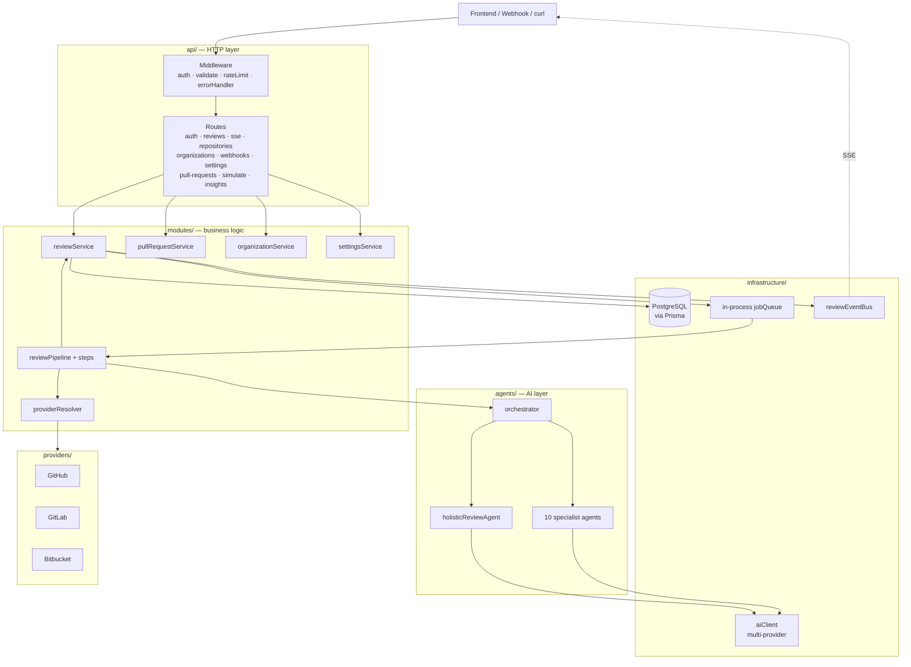

### Backend directory map

```
backend/
├── prisma/
│   ├── schema.prisma              # Source of truth for the data model
│   └── migrations/                # Versioned SQL migrations
│
└── src/
    ├── index.ts                   # Process entry: register pipeline, start server, graceful shutdown
    ├── constants.ts               # Shared constants
    ├── config/                    # Zod-validated env (fails fast at boot)
    ├── errors/AppError.ts         # Typed HTTP errors (.badRequest/.notFound/.internal/.external…)
    ├── types/                     # Domain types: Finding, ReviewContext, MergeRecommendation…
    │
    ├── api/                       # ── HTTP layer (Express-only) ──
    │   ├── server.ts              # App factory: middleware order + route mounting + /health
    │   ├── middleware/            # auth · validate · rateLimit · errorHandler · asyncHandler
    │   ├── routes/                # One router per resource
    │   └── schemas/               # Zod request schemas
    │
    ├── modules/                   # ── Business logic (no Express) ──
    │   ├── auth/                  # register / login / JWT
    │   ├── reviews/               # the heart of the app (see below)
    │   │   ├── reviewService.ts   # CRUD, status updates, finalize, ownership
    │   │   ├── reviewEnqueueService.ts  # validate input → create row → enqueue job
    │   │   ├── reviewPipeline.ts  # registers the job handler
    │   │   ├── pipeline/steps.ts  # step1Fetch → step2Analyze → step3Comment → step5Complete
    │   │   ├── postToProviderService.ts # pushes stored comments to the PR on demand
    │   │   ├── prDetailService.ts # commits / checks / timeline
    │   │   └── reviewMappers.ts   # DB rows → API DTOs
    │   ├── organizations/         # multi-tenant orgs + per-org encrypted provider keys
    │   ├── repositories/          # connected repos
    │   ├── settings/              # user/org review prefs + AI provider config + resolution
    │   ├── providers/             # providerResolver (org key vs env fallback)
    │   ├── insights/              # dashboard aggregates
    │   ├── comments/              # markdown summary builder
    │   └── shared/                # ownership guards
    │
    ├── agents/                    # ── AI layer (no HTTP, no DB) ──
    │   ├── baseAgent.ts           # LLM call + JSON extraction + normalization
    │   ├── agents.ts              # 10 specialist subclasses + AGENT_REGISTRY + LIGHT_AGENTS
    │   ├── orchestrator.ts        # fan-out → collect → dedupe → risk score → merge decision
    │   ├── holisticReviewAgent.ts # whole-PR narrative pass (different output shape)
    │   └── prompts/               # calibrated system prompts (do not paraphrase)
    │
    ├── providers/                 # ── Git integrations (one file per provider) ──
    │   ├── base.ts                # ProviderAdapter interface
    │   ├── github.ts / gitlab.ts / bitbucket.ts
    │   └── index.ts               # getProvider() / buildProvider()
    │
    ├── infrastructure/            # ── Outside world ──
    │   ├── database/client.ts     # Prisma client + raw pool + healthCheck
    │   ├── jobs/jobQueue.ts       # in-process queue (concurrency + retries + backoff)
    │   ├── events/eventBus.ts     # in-process pub/sub for SSE
    │   └── ai/aiClient.ts         # Anthropic / Gemini / OpenAI / OpenRouter + fallback chain
    │
    └── utils/                     # ── Pure helpers ──
        ├── urlParser.ts           # parse GH/GL/BB PR URLs
        ├── crypto.ts              # AES-256-GCM token encryption
        ├── riskScorer.ts          # 0–100 risk score
        ├── mergeDecider.ts        # APPROVE / NEEDS_CHANGES / BLOCK_MERGE
        ├── findingProcessor.ts    # dedupe + per-agent / per-file summaries
        └── contextBudget.ts       # trims diff/files to fit the token budget
```

### Request lifecycle

Every request flows through the same middleware chain, defined in `api/server.ts`. **Order matters.**

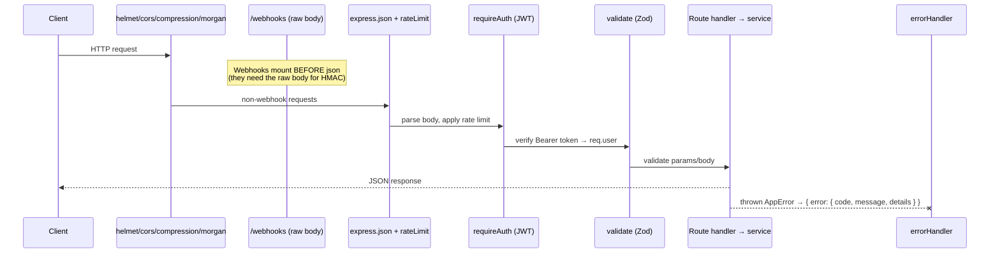

Key detail: **compression is disabled for SSE** (`/progress` and `text/event-stream`) because gzip
buffers the stream and breaks live updates.

### The review pipeline (the core flow)

This is the most important flow in the system. A review is created synchronously (returns a
`reviewId` immediately), then the actual work runs in the background job queue.

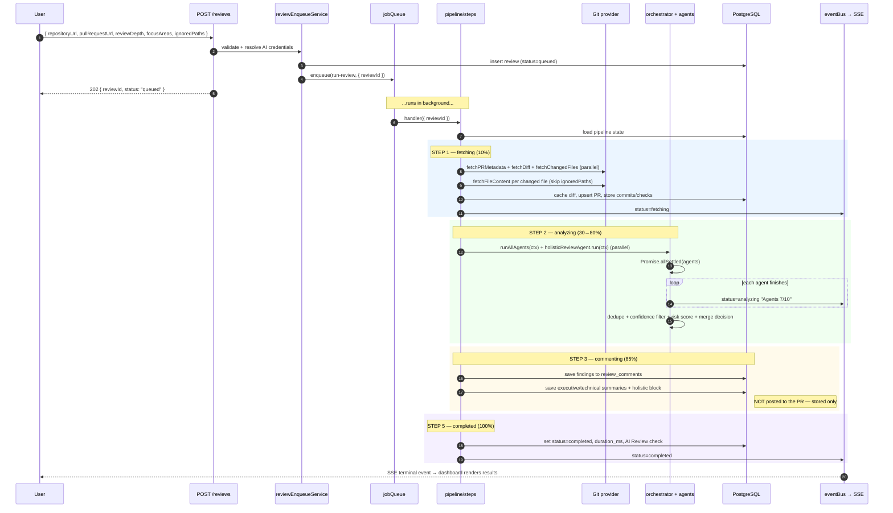

#### The four steps (`modules/reviews/pipeline/steps.ts`)

| Step | Status | Progress | What happens |
|------|--------|----------|--------------|
| `step1Fetch` | `fetching` | 10% | Resolve provider, fetch metadata/diff/files in parallel, cache diff, upsert PR + commits + checks, filter ignored paths |
| `step2Analyze` | `analyzing` | 30→80% | Build `ReviewContext` (with token budget), run specialist agents + holistic agent in parallel, dedupe, score |
| `step3Comment` | `commenting` | 85% | Persist findings + summaries to DB. **No posting to the PR.** |
| `step5Complete` | `completed` | 100% | Set `completed_at`, `duration_ms`, append timeline event, upsert "AI Review" check |

If any step throws, the handler marks the review `failed` with the error message, appends a
`ai_review_failed` timeline event, and the job queue retries with backoff.

#### Review depths

- **`light`** → 3 agents (`security`, `performance`, `business_logic`)
- **`standard`** → all 10 specialist agents
- **`deep`** → all 10 + extended file context (more tokens per file)
- **`focusAreas`** (if provided) overrides depth and runs exactly those agents.

### The AI layer (agents + orchestrator)

Each specialist agent is a single LLM call wrapped by `BaseAgent`. Subclasses provide only an
`agentType` and a calibrated `systemPrompt`; everything else (LLM call, JSON extraction, validation,
defaults, never-throw behavior) is shared.

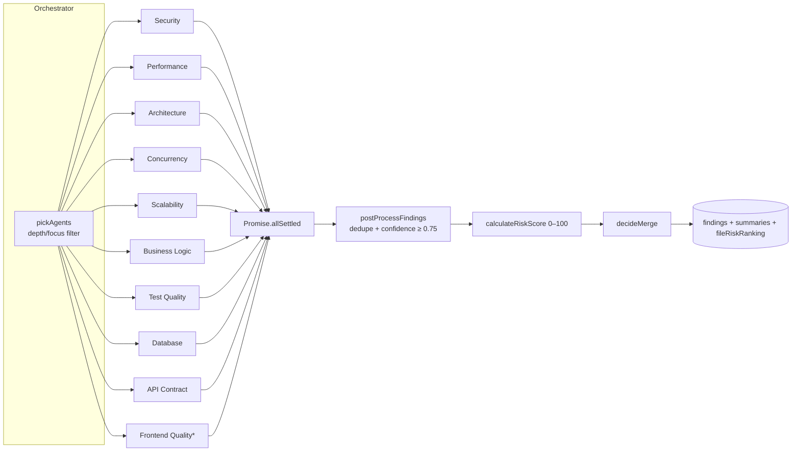

\* `FrontendQualityAgent.shouldRun()` only runs when frontend files (`.tsx/.jsx/.vue/.svelte/.css/...`)
are in the diff.

#### Holistic agent

`holisticReviewAgent` runs *in parallel* with the specialists but is **not** in the registry. It
returns a different shape — a whole-PR narrative: `overview`, `health`, `topPriorityFixes`,
`changedFilesAnalysis` — which is persisted on the `reviews` row and shown as the executive summary.

#### Resilience guarantees

- **An agent never throws out.** Errors → empty findings; the orchestrator uses `allSettled`.
- **Tolerant JSON parsing.** `extractJsonArray` strips ```` ```json ```` fences and surrounding prose.
- **Confidence floor.** Findings below `MIN_FINDING_CONFIDENCE` (default `0.75`) are dropped.
- **Dedupe.** Duplicate findings within ~3 lines on the same file are merged (highest confidence wins).

### AI provider resolution & fallback

The backend supports **Anthropic, Gemini, OpenAI, and OpenRouter**. Credentials are resolved
per-review with a precedence chain, then the `aiClient` tries the primary and falls back on failure.

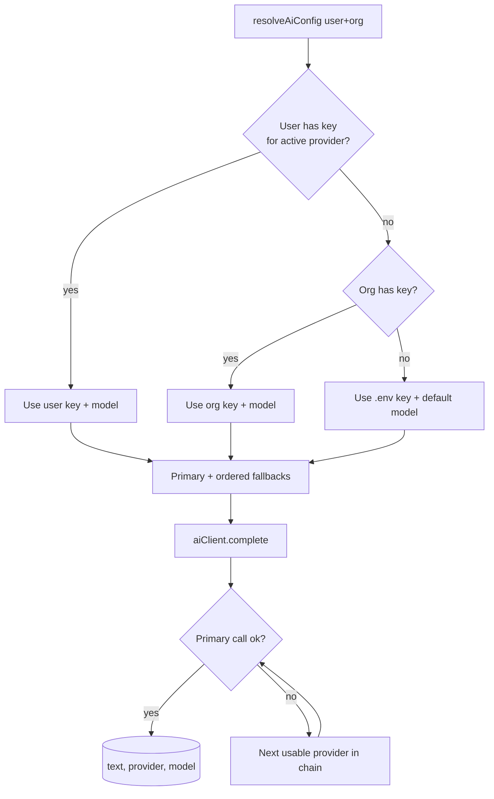

- **Per-field precedence:** user settings → org settings → environment variables.
- Keys stored in settings are **encrypted at rest** (AES-256-GCM via `utils/crypto.ts`).
- `GET /health` reports which providers are live and which models are configured.
- OpenRouter calls have their own retry (429/502/503/504) and a `openrouter/free` model fallback on 404.

### Git provider adapters

All three providers implement the same `ProviderAdapter` interface (`providers/base.ts`), so the
pipeline is provider-agnostic.

```ts
interface ProviderAdapter {
  fetchPRMetadata(prUrl): Promise<PRMetadata>;
  fetchDiff(prUrl): Promise<string>;
  fetchChangedFiles(prUrl): Promise<string[]>;
  fetchFileContent(repoUrl, path, ref): Promise<string | null>;
  postReviewComments(...): Promise<...>;   // used only on explicit "Post to provider"
  verifyWebhook(...): boolean;
  fetchCommits?(prUrl): Promise<...>;       // optional enrichment
  fetchChecks?(prUrl): Promise<...>;        // optional enrichment
}
```

`providerResolver` decides *which credentials* to use: an org's encrypted key when the repo belongs
to an organization, otherwise the env-default token.

### Background jobs & retries

`infrastructure/jobs/jobQueue.ts` is a small in-process queue:

- **Concurrency** bounded by `JOB_CONCURRENCY` (default 2).
- **Retries** up to `JOB_MAX_ATTEMPTS` (default 2) with **exponential backoff**: 5s → 15s → 45s → 135s (capped at 5 min).
- Handlers do their own DB cleanup; a thrown handler **never crashes** the queue.
- `jobQueue.stats()` is surfaced on `/health`.

On boot, `reviewService.failStuckReviews()` reclaims any reviews left mid-flight by a crash/restart.

### Data model

Defined in `prisma/schema.prisma`. Columns are snake_case in PostgreSQL, camelCase in code (`@map`).

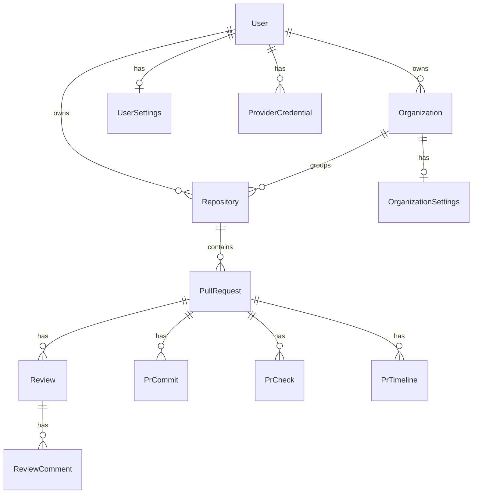

Highlights:

- **`Review`** holds status, depth, `riskScore`, `mergeRecommendation`, summaries, holistic JSON
  (`topPriorityFixes`, `changedFilesAnalysis`), cached diff, and `postedToProviderAt`.
- **`ReviewComment`** is one finding: agent, severity, confidence, file/line, issue/impact/
  recommendation/suggestedFix, plus `postedToProvider` and `discardedAt` flags.
- **`UserSettings` / `OrganizationSettings`** store review preferences **and** per-provider AI keys
  (encrypted) + models. Org rows also carry an encrypted provider API key + webhook secret.

### Security (backend)

- **Auth:** JWT (`Authorization: Bearer`), bcrypt password hashing (12 rounds), timing-safe login.
- **Token encryption:** `utils/crypto.ts` AES-256-GCM, format `v1.<iv>.<authTag>.<ciphertext>`
  (the `v1` prefix allows key/algorithm rotation). Used for provider tokens, webhook secrets, AI keys.
- **Webhook verification:** HMAC-SHA256 (`X-Hub-Signature-256` for GitHub/Bitbucket; token for
  GitLab). Webhooks mount the **raw body parser** before `express.json` so the signature matches.
- **Hardening:** helmet, CORS locked to `FRONTEND_URL`, per-route rate limits, 1 MB body cap.
- **Fail-fast config:** `config/` validates every env var with Zod at boot — bad config never reaches runtime.
- **Ownership guards:** `modules/shared/ownership.ts` ensures users only touch their own resources.

### Full backend API reference

| Method | Path | Auth | Description |
|--------|------|------|-------------|
| `POST` | `/auth/register` | — | Create account, returns JWT |
| `POST` | `/auth/login` | — | Returns JWT |
| `GET` | `/auth/me` | JWT | Validate token |
| `POST` | `/reviews` | JWT | Submit a PR for review (returns `reviewId`) |
| `GET` | `/reviews` | JWT | List reviews (paginated) |
| `GET` | `/reviews/:id` | JWT | Full review result |
| `GET` | `/reviews/:id/progress` | JWT/`?token=` | **SSE** live progress |
| `GET` | `/reviews/lookup/:org/:repo/pulls/:prId` | JWT | Resolve review by PR coordinates |
| `POST` | `/reviews/:id/retry` | JWT | Re-run a failed review |
| `POST` | `/reviews/:id/post-to-github` | JWT | Push stored findings + summary to the PR |
| `DELETE` | `/reviews/:id/comments/:commentId` | JWT | Discard a finding |
| `POST` | `/reviews/:id/comments/:commentId/restore` | JWT | Restore a discarded finding |
| `GET`/`POST` | `/repositories` | JWT | List / connect repos |
| `GET` | `/repositories/:id` · `/:id/pull-requests` | JWT | Repo detail / PR list |
| `PATCH` | `/repositories/:id` | JWT | Update a repo |
| `GET`/`POST` | `/organizations` | JWT | List / create orgs |
| `GET`/`PATCH`/`DELETE` | `/organizations/:id` | JWT | Org CRUD |
| `GET`/`PATCH` | `/organizations/:id/settings` | JWT | Org settings (incl. AI config) |
| `POST` | `/organizations/:id/webhook/rotate` | JWT | Rotate webhook secret |
| `GET`/`POST` | `/organizations/:id/repositories` | JWT | Org repos |
| `GET` | `/organizations/:id/provider-repos` | JWT | List repos from the provider |
| `GET` | `/pull-requests/:id` · `/:id/detail` | JWT | PR detail (commits/checks/timeline) |
| `POST` | `/pull-requests/:id/review` | JWT | Start a review for a known PR |
| `POST` | `/pull-requests/:id/state` · `/:id/comments` | JWT | Update state / add comment |
| `GET` | `/pull-requests/lookup/:org/:repo/:prId` | JWT | Resolve PR by coordinates |
| `GET`/`PATCH` | `/settings` | JWT | User settings (review prefs + AI config) |
| `GET` | `/insights` | JWT | Dashboard aggregates |
| `POST` | `/simulate` | JWT | Try the pipeline on pasted code (no real PR) |
| `POST` | `/webhooks/{github,gitlab,bitbucket}[/:slug]` | HMAC/token | Auto-queue a review |
| `GET` | `/health` | — | DB + queue + AI provider status |

### Backend configuration

Copy `.env.example` → `.env`. At minimum set `JWT_SECRET`, `DATABASE_URL`, **one** AI key
(`ANTHROPIC_API_KEY` or `OPENROUTER_API_KEY` / `OPENAI_API_KEY` / `GEMINI_API_KEY`), and `GITHUB_TOKEN`.

| Variable | Required | Notes |
|----------|----------|-------|
| `PORT` | no (4000) | API port |
| `JWT_SECRET` | **yes** | ≥16 chars |
| `DATABASE_URL` | **yes** | PostgreSQL connection string |
| `ANTHROPIC_API_KEY` | one of\* | Primary LLM |
| `OPENROUTER_API_KEY` / `OPENAI_API_KEY` / `GEMINI_API_KEY` | one of\* | Alternatives / fallback |
| `ANTHROPIC_MODEL` etc. | no | Per-provider model overrides |
| `GITHUB_TOKEN` | **yes** | PAT with `repo` scope |
| `GITLAB_TOKEN` / `BITBUCKET_TOKEN` | per provider | Access tokens |
| `*_WEBHOOK_SECRET` | for webhooks | HMAC/token secrets |
| `TOKEN_ENCRYPTION_KEY` | prod | 32-byte hex for AES-256-GCM |
| `FRONTEND_URL` | no | CORS origin (default `http://localhost:3000`) |
| `JOB_CONCURRENCY` / `JOB_MAX_ATTEMPTS` | no | Queue tuning |
| `MIN_FINDING_CONFIDENCE` | no (0.75) | Drop findings below this |

\* At least one AI key is required or boot is rejected by the config validator.

### Backend local development

```bash
# 1. Start PostgreSQL (Docker)
docker run -d --name pr-review-db \
  -e POSTGRES_PASSWORD=password -e POSTGRES_DB=pr_review \
  -p 5432:5432 postgres:16

# 2. Backend
cd backend
cp .env.example .env            # fill in secrets
npm install                     # runs `prisma generate` (postinstall)
npm run db:migrate              # apply migrations
npm run dev                     # http://localhost:4000  (tsx watch)
```

Useful scripts: `npm run build` (tsc), `npm start` (dist), `npm run db:studio` (Prisma Studio),
`npm run typecheck`, `npm test`.

### Backend testing

```bash
npm test          # vitest run
npm run test:watch
```

Unit tests cover the pure, high-value logic — `riskScorer`, `mergeDecider`, `findingProcessor`,
`providerResolver`, `reviewPreferences`, and `ownership` — without needing a database or network.

---

## Frontend deep dive

> Full frontend documentation, integrated from `frontend/README.md`.

The frontend is a **Next.js 14 (App Router) + TypeScript + Tailwind** dashboard for the PR Review
AI system. It lets users connect repositories, browse pull requests, submit a PR for AI review,
watch the review run **live** (Server-Sent Events), explore findings agent-by-agent and file-by-file,
and push the generated comments to the PR on demand.

The UI is styled as a **GitHub-like dark interface** (`gh-*` design tokens in `tailwind.config.ts`)
built on accessible **shadcn/Radix** primitives.

### Frontend design philosophy

Three rules keep the frontend predictable:

1. **Components never call `fetch()` directly.** All network access goes through the typed client in
   `lib/api/*`, wrapped by React Query hooks in `lib/hooks/*`. Components consume hooks only.
2. **Server state ≠ UI state.** React Query owns everything that comes from the backend (caching,
   refetch, loading/error). React context owns the little bit of cross-cutting *client* state (auth
   user, active org). Local component state owns the rest.
3. **The UI mirrors the backend's domain.** `types/index.ts` is a mirror of the backend's domain
   types, so a finding, review, or PR has the same shape end-to-end.

```
Pages (app/)
   │ render
   ▼
Components (components/)
   │ call
   ▼
Hooks (lib/hooks/)  ──uses──►  React Query cache
   │ call
   ▼
API client (lib/api/)  ──fetch──►  Backend
```

### Frontend tech stack

| Tool | Role | Why |
|------|------|-----|
| **Next.js 14 (App Router)** | Framework + routing | File-based routes, route groups, layouts, RSC-ready |
| **React 18 + TypeScript** | UI + types | Component model with end-to-end typing |
| **Tailwind CSS** | Styling | Utility-first; matches the GitHub-dark design tokens |
| **shadcn/ui (Radix)** | Primitives | Accessible Button/Card/Tabs/Accordion/Label with no bundle bloat |
| **@tanstack/react-query** | Server state | Caching, background refetch, mutations, invalidation |
| **react-hook-form + Zod** | Forms | Performant forms with schema validation |
| **@microsoft/fetch-event-source** | SSE client | Live progress with auth headers (native `EventSource` can't) |
| **recharts** | Charts | Risk-trend chart on the dashboard |
| **lucide-react** | Icons | Consistent icon set |
| **sonner** | Toasts | Success/error notifications |
| **date-fns** | Dates | Relative timestamps |
| **vitest + Testing Library** | Tests | Unit tests for pure logic + components |

### Frontend architecture overview

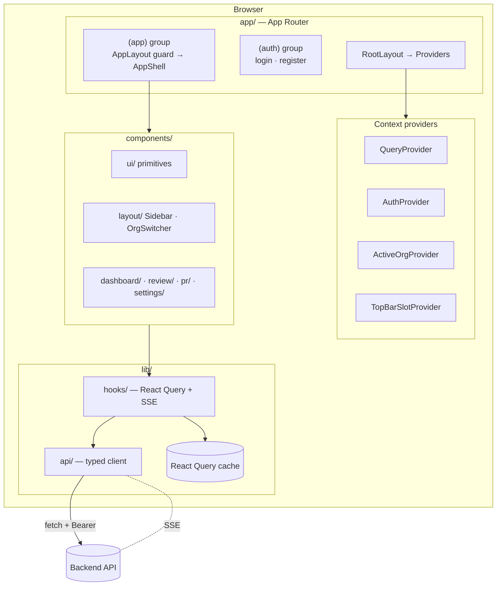

### Frontend directory map

```
frontend/
├── next.config.mjs · tailwind.config.ts · tsconfig.json · vitest.config.ts
└── src/
    ├── app/                       # ── App Router ──
    │   ├── layout.tsx             # RootLayout: fonts + <Providers>
    │   ├── page.tsx               # Landing → redirects based on auth
    │   ├── (auth)/                # Public group (login, register) — own layout
    │   └── (app)/                 # Protected group — AppLayout guard + AppShell sidebar
    │       ├── dashboard/         # Stats, risk chart, recent reviews
    │       ├── ai-reviews/        # AI review history
    │       ├── insights/          # Aggregated metrics
    │       ├── repositories/      # Connected repos
    │       ├── organizations/     # Org list / new / [slug]
    │       ├── [org]/[repo]/pulls # PR list + [prId] detail (GitHub-style URLs)
    │       ├── review/[id]        # Review result by id  +  review/new
    │       ├── settings/          # Review preferences
    │       ├── api-keys/          # AI provider keys
    │       ├── webhooks/          # Webhook setup
    │       └── simulate/          # Try the pipeline on pasted code
    │
    ├── components/                # ── UI ──
    │   ├── ui/                    # shadcn primitives: button, card, tabs, accordion, badge…
    │   ├── layout/                # Sidebar (AppShell), SidebarNav, OrgSwitcher, TopBarActions
    │   ├── providers/             # Providers (context tree) + QueryProvider
    │   ├── shared/                # PageHeader, QueryState, Skeleton, ErrorBoundary, filters
    │   ├── dashboard/             # LivePullRequestList, RepoPicker, DashboardWidgets, dialogs
    │   ├── pr/                    # PrPageHeader, prBadges
    │   ├── review/                # ReviewView, ReviewProgress, AgentResultsPanel,
    │   │                          #   FilesChangedBrowser, HolisticSummaryPanel, PostToGitHubButton…
    │   ├── settings/             # AiProviderSettingsForm, ApiKeysPanel, ReviewPreferenceFields
    │   └── organizations/        # OrganizationSettingsForm, RepositoryCombobox, SetupGuide
    │
    ├── lib/                       # ── Logic ──
    │   ├── api/                   # Typed client: client.ts (apiFetch) + auth/reviews/repositories/…
    │   ├── hooks/                 # useAuth, useActiveOrg, useReview, useReviewProgress,
    │   │                          #   useStartReview, useSettings, useRepositoryPRs, useReviewView…
    │   ├── queryKeys.ts           # Centralized React Query keys (consistent invalidation)
    │   ├── routes.ts              # URL builders (prefer clean /org/repo/pulls URLs)
    │   ├── auth.ts                # Token storage helpers (localStorage)
    │   ├── reviewProgress.ts / reviewHealth.ts  # Progress + health derivations
    │   └── utils.ts / constants/  # cn(), formatters, provider + review-setting constants
    │
    └── types/index.ts            # Domain types mirrored from the backend
```

### Routing & page map

Next.js **route groups** split the app cleanly. Parentheses in folder names group routes without
adding a URL segment.

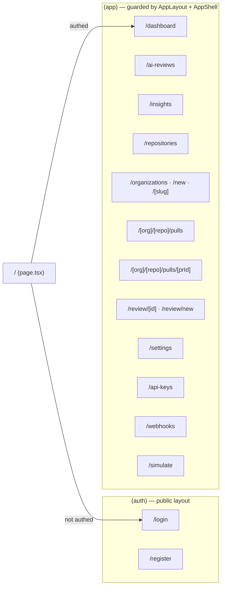

- **`(auth)`** has its own minimal layout (no sidebar).
- **`(app)`** is wrapped by `AppLayout`, which **guards** every protected route (redirects to
  `/login` if there's no token) and renders the `AppShell` (sidebar + top bar).
- PRs use **GitHub-style clean URLs** (`/:org/:repo/pulls/:prId`) when the repo belongs to an org,
  built by `lib/routes.ts`; otherwise it falls back to `/review/:id`.

### Data flow (the layered approach)

A single read path, end to end:

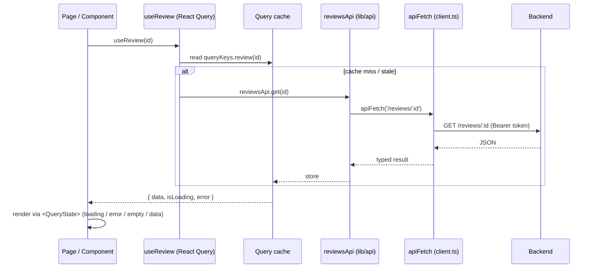

`components/shared/QueryState.tsx` standardizes the loading / error / empty / data branches so every
page handles them the same way.

### Auth flow

JWT is stored in `localStorage` and attached to every request as `Authorization: Bearer`.

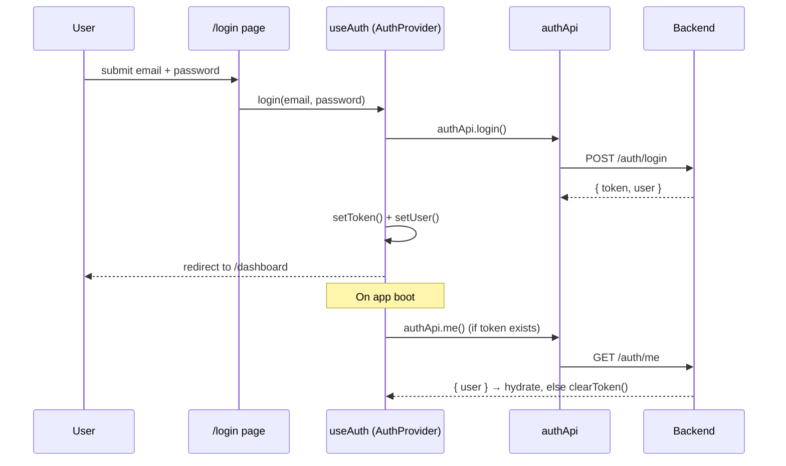

- `AuthProvider` (`lib/hooks/useAuth.tsx`) hydrates the user on mount and exposes
  `login / register / logout`.
- `AppLayout` (`app/(app)/layout.tsx`) defers rendering until after mount (so server HTML matches
  the first client paint) and redirects unauthenticated users to `/login`.

### Submit & live review flow

The flagship flow: submit a PR, watch it run in real time, then explore results.

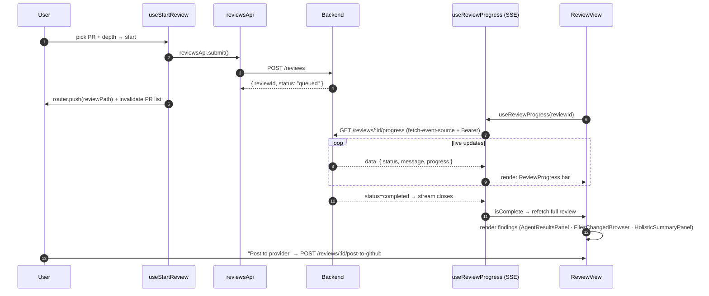

Key client pieces:

- **`useStartReview`** — a React Query mutation that submits, toasts, invalidates the PR list, and
  navigates to the review page.
- **`useReviewProgress`** — wraps `@microsoft/fetch-event-source`. It dedupes repeated events,
  detects terminal states (`completed`/`failed`), ignores benign socket closes (no retry loops),
  and surfaces `{ events, latest, isComplete, error, progress }`.
- **`ReviewView` / `AgentResultsPanel` / `FilesChangedBrowser` / `HolisticSummaryPanel`** — render
  findings grouped by agent and by file, plus the whole-PR holistic summary and merge banner.
- **`PostToGitHubButton`** — the only place comments reach the PR; nothing is auto-posted.

### State management strategy

| Kind of state | Owner | Example |
|---------------|-------|---------|
| **Server state** | React Query (`lib/hooks`) | reviews, repos, settings, insights |
| **Live stream** | `useReviewProgress` (SSE) | review progress events |
| **Cross-cutting client state** | React Context (`Providers`) | auth user, active org, top-bar slot |
| **Local UI state** | `useState` in components | open tab, expanded file, dialog open |
| **Form state** | react-hook-form + Zod | submit form, settings forms |

The provider tree (`components/providers/Providers.tsx`) is a single `'use client'` boundary so
context reaches every route segment:

```
QueryProvider → AuthProvider → ActiveOrgProvider → TopBarSlotProvider → {app} + <Toaster>
```

`lib/queryKeys.ts` centralizes all cache keys so mutations invalidate exactly the right queries.

### The API client layer

`lib/api/client.ts` is the single network chokepoint:

- `apiFetch<T>()` injects the `Authorization` header, sets JSON content type, unwraps the backend's
  `{ error: { code, message } }` envelope into a typed `ApiError`, and handles `204 No Content`.
- `buildQuery()` builds query strings, skipping empty values.

Per-resource modules (`auth.ts`, `reviews.ts`, `repositories.ts`, `organizations.ts`, `settings.ts`,
`insights.ts`, `simulate.ts`) expose typed functions like `reviewsApi.submit()` / `reviewsApi.get()`.
**Components import hooks, hooks import these modules — never the other way around.**

### Component organization

- **`ui/`** — dumb, reusable primitives (shadcn/Radix): `button`, `card`, `tabs`, `accordion`,
  `badge`, `input`, `label`.
- **`shared/`** — app-wide helpers: `PageHeader`/`Spinner`, `QueryState` (loading/error/empty),
  `Skeleton`, `ErrorBoundary`, `MultiSelectFilter`.
- **`layout/`** — `Sidebar` (`AppShell`), `SidebarNav` (`NavSection`/`NavItem` with counts),
  `OrgSwitcher`, `TopBarActions` (a portal slot pages can fill).
- **Feature folders** (`dashboard/`, `pr/`, `review/`, `settings/`, `organizations/`) — composed
  from `ui/` + `shared/`, wired to data through hooks.

### Styling & design system

- **Tailwind** with custom `gh-*` tokens (canvas, border, text, muted, subtle…) defined in
  `tailwind.config.ts` to mimic GitHub's dark theme.
- **`cn()`** (`lib/utils.ts`) merges class names (`clsx` + `tailwind-merge`).
- **Severity / status colors** are centralized so a "critical" finding looks the same everywhere.
- **`tailwindcss-animate`** + Radix power accordions, tabs, and transitions.

### Frontend configuration

`frontend/.env.local`:

| Variable | Required | Default | Description |
|----------|----------|---------|-------------|
| `NEXT_PUBLIC_API_URL` | no | `http://localhost:4000` | Backend API base URL |

(`NEXT_PUBLIC_` prefix is required for the value to reach the browser.)

### Frontend local development

```bash
cd frontend
cp .env.example .env.local       # set NEXT_PUBLIC_API_URL if backend isn't on :4000
npm install
npm run dev                      # http://localhost:3000
```

Scripts: `npm run build` / `npm start` (production), `npm run lint`, `npm run typecheck`, `npm test`.

> The backend must be running for auth, reviews, and SSE to work.

### Frontend testing

```bash
npm test     # vitest run
```

Tests focus on pure logic and small components — e.g. `lib/queryKeys.test.ts` and
`components/pr/prBadges.test.ts` — using Testing Library + jsdom.

---

## Spec documents

The original prompts live in `files/`:

- `BACKEND_PROMPT.md` — Full backend spec (routes, schema, agent prompts, pipeline)
- `FRONTEND_PROMPT.md` — Full frontend spec (pages, components, API client)
- `BUILD_PLAN.md` — 7-phase step-by-step build plan with checkpoints
- `DESIGN_SYSTEM.md` — Color palette, typography, component patterns

When extending the system, always reference these docs — especially agent prompts (calibrated, do not shorten).
