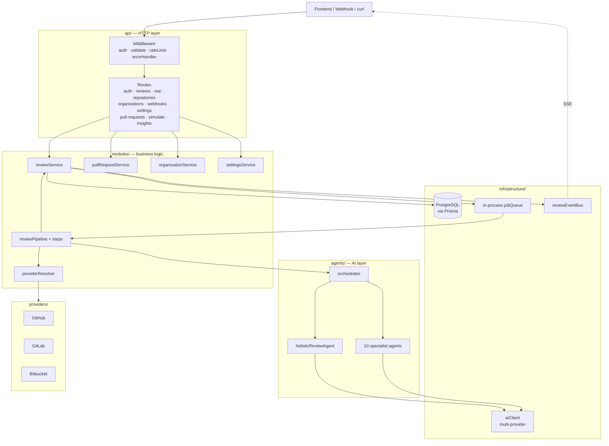
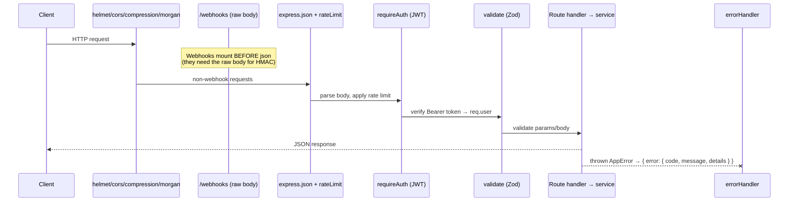
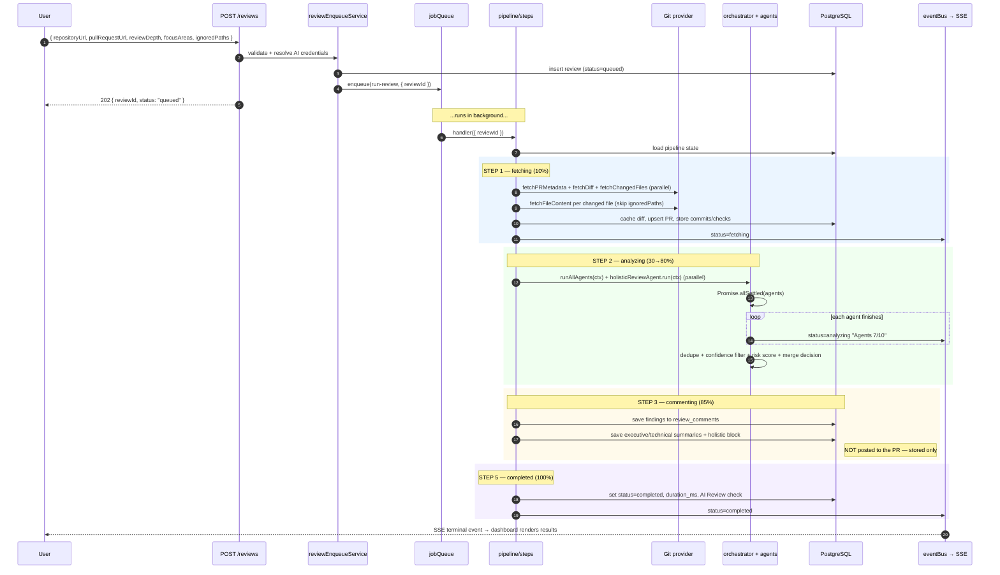
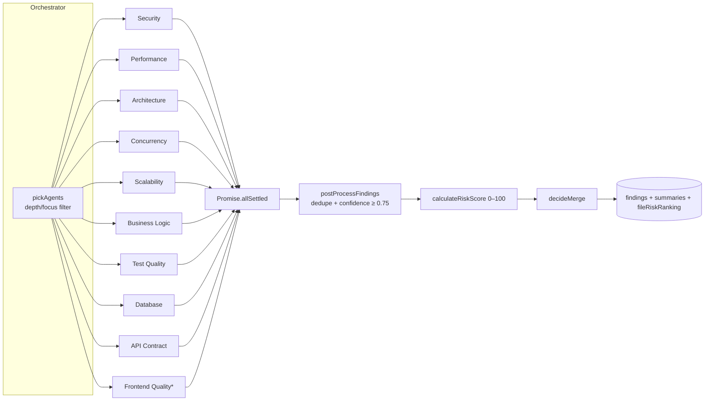
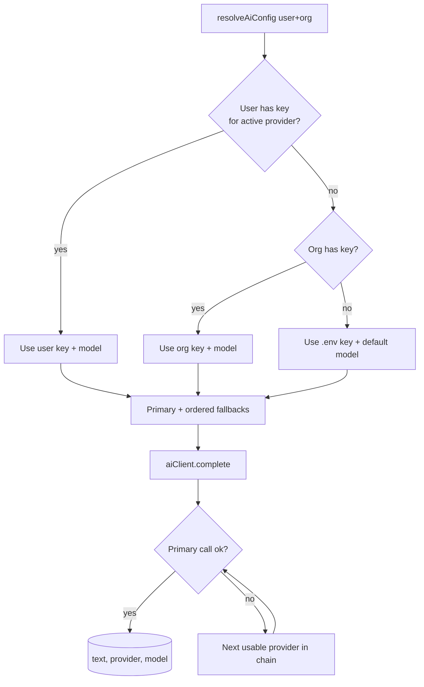
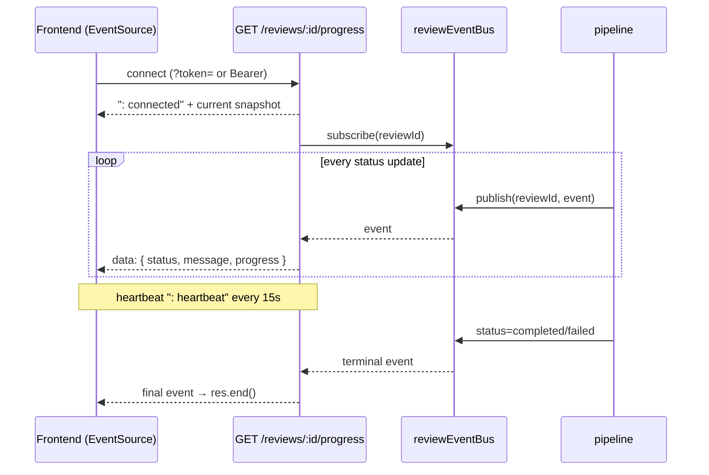
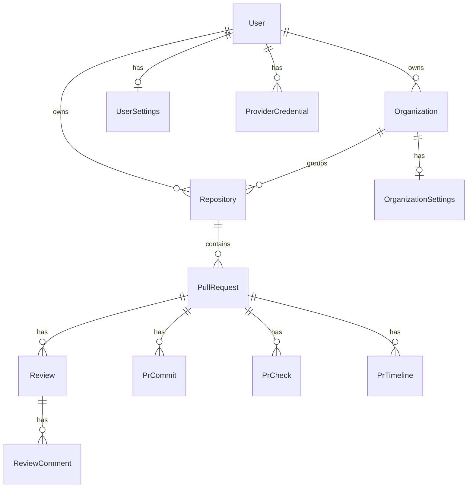

# Backend — PR Review AI API

The backend is a **Node.js + TypeScript + Express** API that turns a Pull Request URL into a
structured, AI-generated code review. It fetches the diff from a Git provider (GitHub / GitLab /
Bitbucket), fans the diff out to **10 specialist AI agents + 1 holistic agent**, deduplicates and
risk-scores the findings, persists everything to **PostgreSQL (via Prisma)**, and streams live
progress to the dashboard over **Server-Sent Events (SSE)**.

> **Nothing is posted to the PR automatically.** Agents only *generate and store* findings. The
> user reviews them in the dashboard and explicitly pushes them to the PR thread via
> `POST /reviews/:id/post-to-github`.

> **No Redis / BullMQ in this build.** Background jobs run in-process (with retries + exponential
> backoff) and live progress uses an in-memory event bus. Each piece keeps the *same interface* as
> a distributed version, so scaling out is a single-file swap. See [Scaling path](#scaling-path).

---

## Table of contents

1. [Design philosophy](#design-philosophy)
2. [Tech stack](#tech-stack)
3. [Layered architecture](#layered-architecture)
4. [Directory map](#directory-map)
5. [Request lifecycle](#request-lifecycle)
6. [The review pipeline (the core flow)](#the-review-pipeline-the-core-flow)
7. [The AI layer (agents + orchestrator)](#the-ai-layer-agents--orchestrator)
8. [AI provider resolution & fallback](#ai-provider-resolution--fallback)
9. [Git provider adapters](#git-provider-adapters)
10. [Live progress over SSE](#live-progress-over-sse)
11. [Background jobs & retries](#background-jobs--retries)
12. [Data model](#data-model)
13. [Security](#security)
14. [API reference](#api-reference)
15. [Configuration](#configuration)
16. [Local development](#local-development)
17. [Testing](#testing)
18. [Scaling path](#scaling-path)

---

## Design philosophy

The whole backend is built around **one strict rule: dependencies point inward.**

```
HTTP (api/)  →  Business logic (modules/)  →  Infrastructure (infrastructure/)
                         ↓                              ↓
                   AI (agents/)                  Providers (providers/)
                         ↓
                   Pure helpers (utils/)
```

- `api/` knows about Express. Nothing else does.
- `modules/` is pure business logic — services that orchestrate work. **No `import express`.**
- `infrastructure/` wraps the outside world (DB, job queue, event bus, AI clients). Swappable.
- `agents/` and `providers/` are isolated integrations behind small interfaces.
- `utils/` are pure, side-effect-free functions (risk score, merge decision, URL parsing, crypto).

**Why this matters:** because the layers are decoupled, you can test the pipeline without HTTP,
swap PostgreSQL helpers without touching agents, and replace the in-process queue with BullMQ by
editing one file.

---

## Tech stack

| Tool | Role | Why |
|------|------|-----|
| **Node.js 20 + TypeScript** | Runtime + types | Strict typing catches bugs before runtime |
| **Express** | HTTP server | Minimal, ubiquitous, easy middleware composition |
| **PostgreSQL + Prisma** | Database + ORM | ACID, JSON columns, type-safe queries, migrations |
| **Zod** | Validation | Validates env at boot **and** every request body/params |
| **@anthropic-ai/sdk + axios** | LLM calls | Anthropic SDK + raw HTTP for Gemini/OpenAI/OpenRouter |
| **@octokit/rest** | GitHub API | Diffs, file contents, posting comments, webhook HMAC |
| **jsonwebtoken + bcryptjs** | Auth | Stateless JWT; bcrypt (12 rounds) password hashing |
| **helmet + cors + compression + morgan** | Hardening | Security headers, CORS, gzip (not SSE), request logs |
| **express-rate-limit** | Abuse protection | Per-IP/user limits (in-memory store for now) |
| **tsx / vitest** | Dev + tests | Fast TS execution; unit tests for pure logic |

---

## Layered architecture



---

## Directory map

```
backend/
├── prisma/
│   ├── schema.prisma              # Source of truth for the data model
│   └── migrations/                # Versioned SQL migrations
│
└── src/
    ├── index.ts                   # Process entry: register pipeline, start server, graceful shutdown
    ├── constants.ts               # Shared constants
    ├── config/                    # Zod-validated env (fails fast at boot)
    ├── errors/AppError.ts         # Typed HTTP errors (.badRequest/.notFound/.internal/.external…)
    ├── types/                     # Domain types: Finding, ReviewContext, MergeRecommendation…
    │
    ├── api/                       # ── HTTP layer (Express-only) ──
    │   ├── server.ts              # App factory: middleware order + route mounting + /health
    │   ├── middleware/            # auth · validate · rateLimit · errorHandler · asyncHandler
    │   ├── routes/                # One router per resource
    │   └── schemas/               # Zod request schemas
    │
    ├── modules/                   # ── Business logic (no Express) ──
    │   ├── auth/                  # register / login / JWT
    │   ├── reviews/               # the heart of the app (see below)
    │   │   ├── reviewService.ts   # CRUD, status updates, finalize, ownership
    │   │   ├── reviewEnqueueService.ts  # validate input → create row → enqueue job
    │   │   ├── reviewPipeline.ts  # registers the job handler
    │   │   ├── pipeline/steps.ts  # step1Fetch → step2Analyze → step3Comment → step5Complete
    │   │   ├── postToProviderService.ts # pushes stored comments to the PR on demand
    │   │   ├── prDetailService.ts # commits / checks / timeline
    │   │   └── reviewMappers.ts   # DB rows → API DTOs
    │   ├── organizations/         # multi-tenant orgs + per-org encrypted provider keys
    │   ├── repositories/          # connected repos
    │   ├── settings/              # user/org review prefs + AI provider config + resolution
    │   ├── providers/             # providerResolver (org key vs env fallback)
    │   ├── insights/              # dashboard aggregates
    │   ├── comments/              # markdown summary builder
    │   └── shared/                # ownership guards
    │
    ├── agents/                    # ── AI layer (no HTTP, no DB) ──
    │   ├── baseAgent.ts           # LLM call + JSON extraction + normalization
    │   ├── agents.ts              # 10 specialist subclasses + AGENT_REGISTRY + LIGHT_AGENTS
    │   ├── orchestrator.ts        # fan-out → collect → dedupe → risk score → merge decision
    │   ├── holisticReviewAgent.ts # whole-PR narrative pass (different output shape)
    │   └── prompts/               # calibrated system prompts (do not paraphrase)
    │
    ├── providers/                 # ── Git integrations (one file per provider) ──
    │   ├── base.ts                # ProviderAdapter interface
    │   ├── github.ts / gitlab.ts / bitbucket.ts
    │   └── index.ts               # getProvider() / buildProvider()
    │
    ├── infrastructure/            # ── Outside world ──
    │   ├── database/client.ts     # Prisma client + raw pool + healthCheck
    │   ├── jobs/jobQueue.ts       # in-process queue (concurrency + retries + backoff)
    │   ├── events/eventBus.ts     # in-process pub/sub for SSE
    │   └── ai/aiClient.ts         # Anthropic / Gemini / OpenAI / OpenRouter + fallback chain
    │
    └── utils/                     # ── Pure helpers ──
        ├── urlParser.ts           # parse GH/GL/BB PR URLs
        ├── crypto.ts              # AES-256-GCM token encryption
        ├── riskScorer.ts          # 0–100 risk score
        ├── mergeDecider.ts        # APPROVE / NEEDS_CHANGES / BLOCK_MERGE
        ├── findingProcessor.ts    # dedupe + per-agent / per-file summaries
        └── contextBudget.ts       # trims diff/files to fit the token budget
```

---

## Request lifecycle

Every request flows through the same middleware chain, defined in `api/server.ts`. **Order matters.**



Key detail: **compression is disabled for SSE** (`/progress` and `text/event-stream`) because gzip
buffers the stream and breaks live updates.

---

## The review pipeline (the core flow)

This is the most important flow in the system. A review is created synchronously (returns a
`reviewId` immediately), then the actual work runs in the background job queue.



### The four steps (`modules/reviews/pipeline/steps.ts`)

| Step | Status | Progress | What happens |
|------|--------|----------|--------------|
| `step1Fetch` | `fetching` | 10% | Resolve provider, fetch metadata/diff/files in parallel, cache diff, upsert PR + commits + checks, filter ignored paths |
| `step2Analyze` | `analyzing` | 30→80% | Build `ReviewContext` (with token budget), run specialist agents + holistic agent in parallel, dedupe, score |
| `step3Comment` | `commenting` | 85% | Persist findings + summaries to DB. **No posting to the PR.** |
| `step5Complete` | `completed` | 100% | Set `completed_at`, `duration_ms`, append timeline event, upsert "AI Review" check |

If any step throws, the handler marks the review `failed` with the error message, appends a
`ai_review_failed` timeline event, and the job queue retries with backoff.

### Review depths

- **`light`** → 3 agents (`security`, `performance`, `business_logic`)
- **`standard`** → all 10 specialist agents
- **`deep`** → all 10 + extended file context (more tokens per file)
- **`focusAreas`** (if provided) overrides depth and runs exactly those agents.

---

## The AI layer (agents + orchestrator)

Each specialist agent is a single LLM call wrapped by `BaseAgent`. Subclasses provide only an
`agentType` and a calibrated `systemPrompt`; everything else (LLM call, JSON extraction, validation,
defaults, never-throw behavior) is shared.



\* `FrontendQualityAgent.shouldRun()` only runs when frontend files (`.tsx/.jsx/.vue/.svelte/.css/...`)
are in the diff.

### The 10 specialist agents

| Agent | Focus |
|-------|-------|
| **Security** | SQLi, XSS, auth bypass, secrets, SSRF |
| **Performance** | N+1 queries, missing indexes, unbounded loops |
| **Architecture** | Layer violations, coupling, pattern divergence |
| **Concurrency** | Race conditions, missing transactions, idempotency |
| **Scalability** | In-memory state, missing queues, unbounded growth |
| **Business Logic** | Edge cases, off-by-one, state machine bugs |
| **Test Quality** | Missing tests, weak assertions, untested paths |
| **Database** | Missing indexes, unsafe migrations, N+1 |
| **API Contract** | Breaking changes, wrong status codes, leaked fields |
| **Frontend Quality** | React bugs, a11y, memory leaks (frontend diffs only) |

### Holistic agent

`holisticReviewAgent` runs *in parallel* with the specialists but is **not** in the registry. It
returns a different shape — a whole-PR narrative: `overview`, `health`, `topPriorityFixes`,
`changedFilesAnalysis` — which is persisted on the `reviews` row and shown as the executive summary.

### Resilience guarantees

- **An agent never throws out.** Errors → empty findings; the orchestrator uses `allSettled`.
- **Tolerant JSON parsing.** `extractJsonArray` strips ```` ```json ```` fences and surrounding prose.
- **Confidence floor.** Findings below `MIN_FINDING_CONFIDENCE` (default `0.75`) are dropped.
- **Dedupe.** Duplicate findings within ~3 lines on the same file are merged (highest confidence wins).

### Scoring

```
riskScore = Σ (severity_weight × confidence), capped at 100
weights: critical=40, high=20, medium=8, low=2
```

| Condition | Merge decision |
|-----------|----------------|
| Any critical (≥0.9 conf) OR score ≥ 80 | `BLOCK_MERGE` |
| ≥3 high OR score ≥ 60 | `NEEDS_CHANGES` |
| ≥1 high OR ≥3 medium | `APPROVE_WITH_MINOR_SUGGESTIONS` |
| Otherwise | `APPROVE` |

---

## AI provider resolution & fallback

The backend supports **Anthropic, Gemini, OpenAI, and OpenRouter**. Credentials are resolved
per-review with a precedence chain, then the `aiClient` tries the primary and falls back on failure.



- **Per-field precedence:** user settings → org settings → environment variables.
- Keys stored in settings are **encrypted at rest** (AES-256-GCM via `utils/crypto.ts`).
- `GET /health` reports which providers are live and which models are configured.
- OpenRouter calls have their own retry (429/502/503/504) and a `openrouter/free` model fallback on 404.

---

## Git provider adapters

All three providers implement the same `ProviderAdapter` interface (`providers/base.ts`), so the
pipeline is provider-agnostic.

```ts
interface ProviderAdapter {
  fetchPRMetadata(prUrl): Promise<PRMetadata>;
  fetchDiff(prUrl): Promise<string>;
  fetchChangedFiles(prUrl): Promise<string[]>;
  fetchFileContent(repoUrl, path, ref): Promise<string | null>;
  postReviewComments(...): Promise<...>;   // used only on explicit "Post to provider"
  verifyWebhook(...): boolean;
  fetchCommits?(prUrl): Promise<...>;       // optional enrichment
  fetchChecks?(prUrl): Promise<...>;        // optional enrichment
}
```

`providerResolver` decides *which credentials* to use: an org's encrypted key when the repo belongs
to an organization, otherwise the env-default token.

---

## Live progress over SSE



- Browsers can't set headers on `EventSource`, so the route also accepts `?token=`.
- The first snapshot is sent immediately; if already terminal, the stream closes right away.
- A 15s heartbeat keeps proxies from killing idle connections.

---

## Background jobs & retries

`infrastructure/jobs/jobQueue.ts` is a small in-process queue:

- **Concurrency** bounded by `JOB_CONCURRENCY` (default 2).
- **Retries** up to `JOB_MAX_ATTEMPTS` (default 2) with **exponential backoff**: 5s → 15s → 45s → 135s (capped at 5 min).
- Handlers do their own DB cleanup; a thrown handler **never crashes** the queue.
- `jobQueue.stats()` is surfaced on `/health`.

On boot, `reviewService.failStuckReviews()` reclaims any reviews left mid-flight by a crash/restart.

---

## Data model

Defined in `prisma/schema.prisma`. Columns are snake_case in PostgreSQL, camelCase in code (`@map`).



Highlights:

- **`Review`** holds status, depth, `riskScore`, `mergeRecommendation`, summaries, holistic JSON
  (`topPriorityFixes`, `changedFilesAnalysis`), cached diff, and `postedToProviderAt`.
- **`ReviewComment`** is one finding: agent, severity, confidence, file/line, issue/impact/
  recommendation/suggestedFix, plus `postedToProvider` and `discardedAt` flags.
- **`UserSettings` / `OrganizationSettings`** store review preferences **and** per-provider AI keys
  (encrypted) + models. Org rows also carry an encrypted provider API key + webhook secret.

---

## Security

- **Auth:** JWT (`Authorization: Bearer`), bcrypt password hashing (12 rounds), timing-safe login.
- **Token encryption:** `utils/crypto.ts` AES-256-GCM, format `v1.<iv>.<authTag>.<ciphertext>`
  (the `v1` prefix allows key/algorithm rotation). Used for provider tokens, webhook secrets, AI keys.
- **Webhook verification:** HMAC-SHA256 (`X-Hub-Signature-256` for GitHub/Bitbucket; token for
  GitLab). Webhooks mount the **raw body parser** before `express.json` so the signature matches.
- **Hardening:** helmet, CORS locked to `FRONTEND_URL`, per-route rate limits, 1 MB body cap.
- **Fail-fast config:** `config/` validates every env var with Zod at boot — bad config never reaches runtime.
- **Ownership guards:** `modules/shared/ownership.ts` ensures users only touch their own resources.

---

## API reference

| Method | Path | Auth | Description |
|--------|------|------|-------------|
| `POST` | `/auth/register` | — | Create account, returns JWT |
| `POST` | `/auth/login` | — | Returns JWT |
| `GET` | `/auth/me` | JWT | Validate token |
| `POST` | `/reviews` | JWT | Submit a PR for review (returns `reviewId`) |
| `GET` | `/reviews` | JWT | List reviews (paginated) |
| `GET` | `/reviews/:id` | JWT | Full review result |
| `GET` | `/reviews/:id/progress` | JWT/`?token=` | **SSE** live progress |
| `GET` | `/reviews/lookup/:org/:repo/pulls/:prId` | JWT | Resolve review by PR coordinates |
| `POST` | `/reviews/:id/retry` | JWT | Re-run a failed review |
| `POST` | `/reviews/:id/post-to-github` | JWT | Push stored findings + summary to the PR |
| `DELETE` | `/reviews/:id/comments/:commentId` | JWT | Discard a finding |
| `POST` | `/reviews/:id/comments/:commentId/restore` | JWT | Restore a discarded finding |
| `GET`/`POST` | `/repositories` | JWT | List / connect repos |
| `GET` | `/repositories/:id` · `/:id/pull-requests` | JWT | Repo detail / PR list |
| `PATCH` | `/repositories/:id` | JWT | Update a repo |
| `GET`/`POST` | `/organizations` | JWT | List / create orgs |
| `GET`/`PATCH`/`DELETE` | `/organizations/:id` | JWT | Org CRUD |
| `GET`/`PATCH` | `/organizations/:id/settings` | JWT | Org settings (incl. AI config) |
| `POST` | `/organizations/:id/webhook/rotate` | JWT | Rotate webhook secret |
| `GET`/`POST` | `/organizations/:id/repositories` | JWT | Org repos |
| `GET` | `/organizations/:id/provider-repos` | JWT | List repos from the provider |
| `GET` | `/pull-requests/:id` · `/:id/detail` | JWT | PR detail (commits/checks/timeline) |
| `POST` | `/pull-requests/:id/review` | JWT | Start a review for a known PR |
| `POST` | `/pull-requests/:id/state` · `/:id/comments` | JWT | Update state / add comment |
| `GET` | `/pull-requests/lookup/:org/:repo/:prId` | JWT | Resolve PR by coordinates |
| `GET`/`PATCH` | `/settings` | JWT | User settings (review prefs + AI config) |
| `GET` | `/insights` | JWT | Dashboard aggregates |
| `POST` | `/simulate` | JWT | Try the pipeline on pasted code (no real PR) |
| `POST` | `/webhooks/{github,gitlab,bitbucket}[/:slug]` | HMAC/token | Auto-queue a review |
| `GET` | `/health` | — | DB + queue + AI provider status |

**Error envelope (all routes):**

```json
{ "error": { "code": "VALIDATION_ERROR", "message": "…", "details": [] } }
```

---

## Configuration

Copy `.env.example` → `.env`. At minimum set `JWT_SECRET`, `DATABASE_URL`, **one** AI key
(`ANTHROPIC_API_KEY` or `OPENROUTER_API_KEY` / `OPENAI_API_KEY` / `GEMINI_API_KEY`), and `GITHUB_TOKEN`.

| Variable | Required | Notes |
|----------|----------|-------|
| `PORT` | no (4000) | API port |
| `JWT_SECRET` | **yes** | ≥16 chars |
| `DATABASE_URL` | **yes** | PostgreSQL connection string |
| `ANTHROPIC_API_KEY` | one of\* | Primary LLM |
| `OPENROUTER_API_KEY` / `OPENAI_API_KEY` / `GEMINI_API_KEY` | one of\* | Alternatives / fallback |
| `ANTHROPIC_MODEL` etc. | no | Per-provider model overrides |
| `GITHUB_TOKEN` | **yes** | PAT with `repo` scope |
| `GITLAB_TOKEN` / `BITBUCKET_TOKEN` | per provider | Access tokens |
| `*_WEBHOOK_SECRET` | for webhooks | HMAC/token secrets |
| `TOKEN_ENCRYPTION_KEY` | prod | 32-byte hex for AES-256-GCM |
| `FRONTEND_URL` | no | CORS origin (default `http://localhost:3000`) |
| `JOB_CONCURRENCY` / `JOB_MAX_ATTEMPTS` | no | Queue tuning |
| `MIN_FINDING_CONFIDENCE` | no (0.75) | Drop findings below this |

\* At least one AI key is required or boot is rejected by the config validator.

---

## Local development

```bash
# 1. Start PostgreSQL (Docker)
docker run -d --name pr-review-db \
  -e POSTGRES_PASSWORD=password -e POSTGRES_DB=pr_review \
  -p 5432:5432 postgres:16

# 2. Backend
cd backend
cp .env.example .env            # fill in secrets
npm install                     # runs `prisma generate` (postinstall)
npm run db:migrate              # apply migrations
npm run dev                     # http://localhost:4000  (tsx watch)
```

Useful scripts: `npm run build` (tsc), `npm start` (dist), `npm run db:studio` (Prisma Studio),
`npm run typecheck`, `npm test`.

---

## Testing

```bash
npm test          # vitest run
npm run test:watch
```

Unit tests cover the pure, high-value logic — `riskScorer`, `mergeDecider`, `findingProcessor`,
`providerResolver`, `reviewPreferences`, and `ownership` — without needing a database or network.

---

## Scaling path

Every "in-process" piece keeps the same public interface as a distributed version, so growing up is
a one-file change:

1. **Queue → BullMQ** — reimplement `infrastructure/jobs/jobQueue.ts` with `Queue`/`Worker` on Redis.
   `jobQueue.enqueue/register/stats` stay identical.
2. **Event bus → Redis pub/sub** — reimplement `infrastructure/events/eventBus.ts` with
   `redis.publish` / `subscribe`. `reviewEventBus.publish/subscribe` stay identical.
3. **Rate limit → Redis store** — add `rate-limit-redis` to `api/middleware/rateLimit.ts`.

No route, service, or agent changes.
