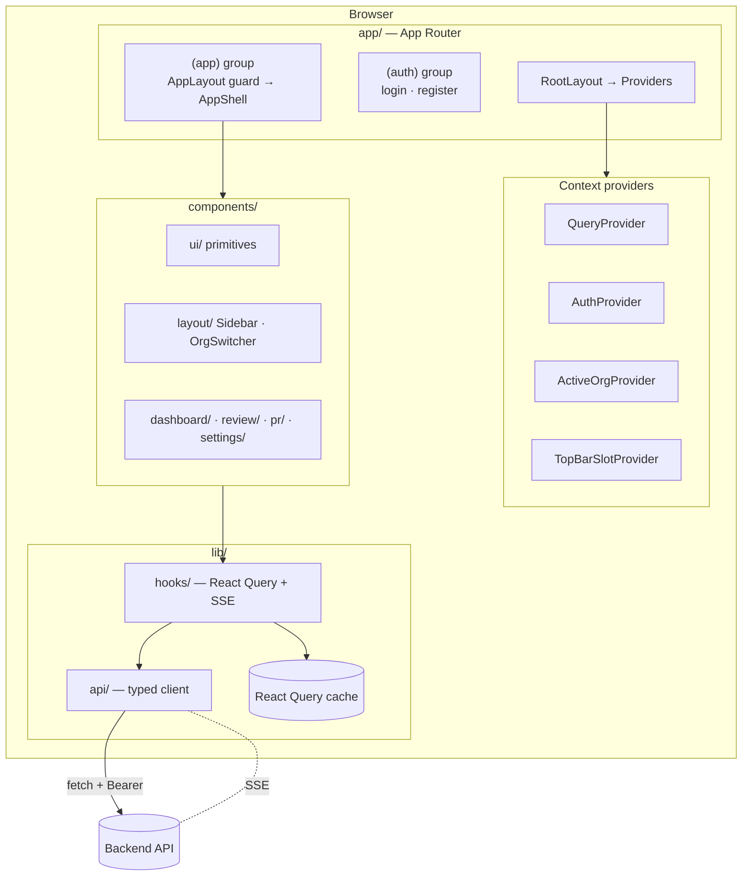
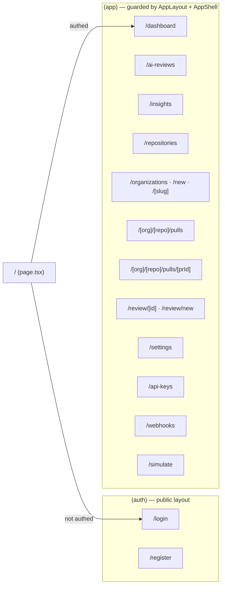
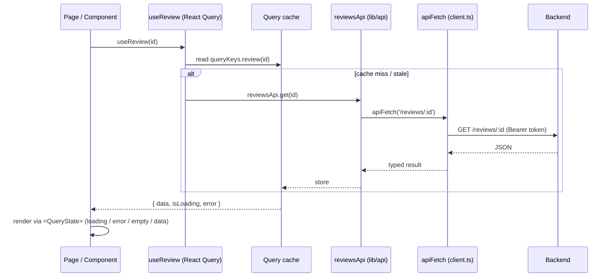
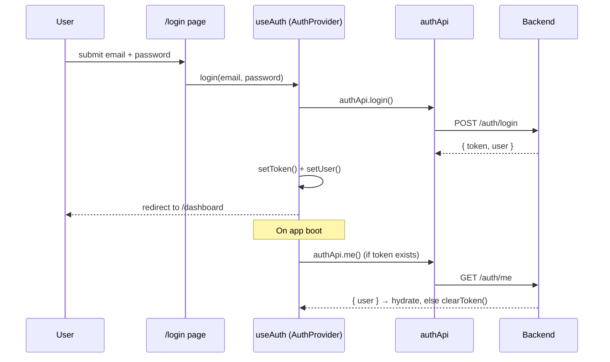
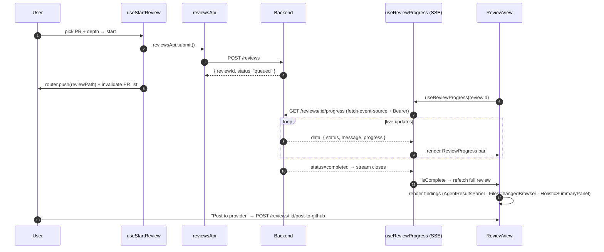

# Frontend — PR Review AI Dashboard

The frontend is a **Next.js 14 (App Router) + TypeScript + Tailwind** dashboard for the PR Review
AI system. It lets users connect repositories, browse pull requests, submit a PR for AI review,
watch the review run **live** (Server-Sent Events), explore findings agent-by-agent and file-by-file,
and push the generated comments to the PR on demand.

The UI is styled as a **GitHub-like dark interface** (`gh-*` design tokens in `tailwind.config.ts`)
built on accessible **shadcn/Radix** primitives.

---

## Table of contents

1. [Design philosophy](#design-philosophy)
2. [Tech stack](#tech-stack)
3. [Architecture overview](#architecture-overview)
4. [Directory map](#directory-map)
5. [Routing & page map](#routing--page-map)
6. [Data flow (the layered approach)](#data-flow-the-layered-approach)
7. [Auth flow](#auth-flow)
8. [Submit & live review flow](#submit--live-review-flow)
9. [State management strategy](#state-management-strategy)
10. [The API client layer](#the-api-client-layer)
11. [Component organization](#component-organization)
12. [Styling & design system](#styling--design-system)
13. [Configuration](#configuration)
14. [Local development](#local-development)
15. [Testing](#testing)

---

## Design philosophy

Three rules keep the frontend predictable:

1. **Components never call `fetch()` directly.** All network access goes through the typed client in
   `lib/api/*`, wrapped by React Query hooks in `lib/hooks/*`. Components consume hooks only.
2. **Server state ≠ UI state.** React Query owns everything that comes from the backend (caching,
   refetch, loading/error). React context owns the little bit of cross-cutting *client* state (auth
   user, active org). Local component state owns the rest.
3. **The UI mirrors the backend's domain.** `types/index.ts` is a mirror of the backend's domain
   types, so a finding, review, or PR has the same shape end-to-end.

```
Pages (app/)
   │ render
   ▼
Components (components/)
   │ call
   ▼
Hooks (lib/hooks/)  ──uses──►  React Query cache
   │ call
   ▼
API client (lib/api/)  ──fetch──►  Backend
```

---

## Tech stack

| Tool | Role | Why |
|------|------|-----|
| **Next.js 14 (App Router)** | Framework + routing | File-based routes, route groups, layouts, RSC-ready |
| **React 18 + TypeScript** | UI + types | Component model with end-to-end typing |
| **Tailwind CSS** | Styling | Utility-first; matches the GitHub-dark design tokens |
| **shadcn/ui (Radix)** | Primitives | Accessible Button/Card/Tabs/Accordion/Label with no bundle bloat |
| **@tanstack/react-query** | Server state | Caching, background refetch, mutations, invalidation |
| **react-hook-form + Zod** | Forms | Performant forms with schema validation |
| **@microsoft/fetch-event-source** | SSE client | Live progress with auth headers (native `EventSource` can't) |
| **recharts** | Charts | Risk-trend chart on the dashboard |
| **lucide-react** | Icons | Consistent icon set |
| **sonner** | Toasts | Success/error notifications |
| **date-fns** | Dates | Relative timestamps |
| **vitest + Testing Library** | Tests | Unit tests for pure logic + components |

---

## Architecture overview



---

## Directory map

```
frontend/
├── next.config.mjs · tailwind.config.ts · tsconfig.json · vitest.config.ts
└── src/
    ├── app/                       # ── App Router ──
    │   ├── layout.tsx             # RootLayout: fonts + <Providers>
    │   ├── page.tsx               # Landing → redirects based on auth
    │   ├── (auth)/                # Public group (login, register) — own layout
    │   └── (app)/                 # Protected group — AppLayout guard + AppShell sidebar
    │       ├── dashboard/         # Stats, risk chart, recent reviews
    │       ├── ai-reviews/        # AI review history
    │       ├── insights/          # Aggregated metrics
    │       ├── repositories/      # Connected repos
    │       ├── organizations/     # Org list / new / [slug]
    │       ├── [org]/[repo]/pulls # PR list + [prId] detail (GitHub-style URLs)
    │       ├── review/[id]        # Review result by id  +  review/new
    │       ├── settings/          # Review preferences
    │       ├── api-keys/          # AI provider keys
    │       ├── webhooks/          # Webhook setup
    │       └── simulate/          # Try the pipeline on pasted code
    │
    ├── components/                # ── UI ──
    │   ├── ui/                    # shadcn primitives: button, card, tabs, accordion, badge…
    │   ├── layout/                # Sidebar (AppShell), SidebarNav, OrgSwitcher, TopBarActions
    │   ├── providers/             # Providers (context tree) + QueryProvider
    │   ├── shared/                # PageHeader, QueryState, Skeleton, ErrorBoundary, filters
    │   ├── dashboard/             # LivePullRequestList, RepoPicker, DashboardWidgets, dialogs
    │   ├── pr/                    # PrPageHeader, prBadges
    │   ├── review/                # ReviewView, ReviewProgress, AgentResultsPanel,
    │   │                          #   FilesChangedBrowser, HolisticSummaryPanel, PostToGitHubButton…
    │   ├── settings/             # AiProviderSettingsForm, ApiKeysPanel, ReviewPreferenceFields
    │   └── organizations/        # OrganizationSettingsForm, RepositoryCombobox, SetupGuide
    │
    ├── lib/                       # ── Logic ──
    │   ├── api/                   # Typed client: client.ts (apiFetch) + auth/reviews/repositories/…
    │   ├── hooks/                 # useAuth, useActiveOrg, useReview, useReviewProgress,
    │   │                          #   useStartReview, useSettings, useRepositoryPRs, useReviewView…
    │   ├── queryKeys.ts           # Centralized React Query keys (consistent invalidation)
    │   ├── routes.ts              # URL builders (prefer clean /org/repo/pulls URLs)
    │   ├── auth.ts                # Token storage helpers (localStorage)
    │   ├── reviewProgress.ts / reviewHealth.ts  # Progress + health derivations
    │   └── utils.ts / constants/  # cn(), formatters, provider + review-setting constants
    │
    └── types/index.ts            # Domain types mirrored from the backend
```

---

## Routing & page map

Next.js **route groups** split the app cleanly. Parentheses in folder names group routes without
adding a URL segment.



- **`(auth)`** has its own minimal layout (no sidebar).
- **`(app)`** is wrapped by `AppLayout`, which **guards** every protected route (redirects to
  `/login` if there's no token) and renders the `AppShell` (sidebar + top bar).
- PRs use **GitHub-style clean URLs** (`/:org/:repo/pulls/:prId`) when the repo belongs to an org,
  built by `lib/routes.ts`; otherwise it falls back to `/review/:id`.

---

## Data flow (the layered approach)

A single read path, end to end:



`components/shared/QueryState.tsx` standardizes the loading / error / empty / data branches so every
page handles them the same way.

---

## Auth flow

JWT is stored in `localStorage` and attached to every request as `Authorization: Bearer`.



- `AuthProvider` (`lib/hooks/useAuth.tsx`) hydrates the user on mount and exposes
  `login / register / logout`.
- `AppLayout` (`app/(app)/layout.tsx`) defers rendering until after mount (so server HTML matches
  the first client paint) and redirects unauthenticated users to `/login`.

---

## Submit & live review flow

The flagship flow: submit a PR, watch it run in real time, then explore results.



Key client pieces:

- **`useStartReview`** — a React Query mutation that submits, toasts, invalidates the PR list, and
  navigates to the review page.
- **`useReviewProgress`** — wraps `@microsoft/fetch-event-source`. It dedupes repeated events,
  detects terminal states (`completed`/`failed`), ignores benign socket closes (no retry loops),
  and surfaces `{ events, latest, isComplete, error, progress }`.
- **`ReviewView` / `AgentResultsPanel` / `FilesChangedBrowser` / `HolisticSummaryPanel`** — render
  findings grouped by agent and by file, plus the whole-PR holistic summary and merge banner.
- **`PostToGitHubButton`** — the only place comments reach the PR; nothing is auto-posted.

---

## State management strategy

| Kind of state | Owner | Example |
|---------------|-------|---------|
| **Server state** | React Query (`lib/hooks`) | reviews, repos, settings, insights |
| **Live stream** | `useReviewProgress` (SSE) | review progress events |
| **Cross-cutting client state** | React Context (`Providers`) | auth user, active org, top-bar slot |
| **Local UI state** | `useState` in components | open tab, expanded file, dialog open |
| **Form state** | react-hook-form + Zod | submit form, settings forms |

The provider tree (`components/providers/Providers.tsx`) is a single `'use client'` boundary so
context reaches every route segment:

```
QueryProvider → AuthProvider → ActiveOrgProvider → TopBarSlotProvider → {app} + <Toaster>
```

`lib/queryKeys.ts` centralizes all cache keys so mutations invalidate exactly the right queries.

---

## The API client layer

`lib/api/client.ts` is the single network chokepoint:

- `apiFetch<T>()` injects the `Authorization` header, sets JSON content type, unwraps the backend's
  `{ error: { code, message } }` envelope into a typed `ApiError`, and handles `204 No Content`.
- `buildQuery()` builds query strings, skipping empty values.

Per-resource modules (`auth.ts`, `reviews.ts`, `repositories.ts`, `organizations.ts`, `settings.ts`,
`insights.ts`, `simulate.ts`) expose typed functions like `reviewsApi.submit()` / `reviewsApi.get()`.
**Components import hooks, hooks import these modules — never the other way around.**

---

## Component organization

- **`ui/`** — dumb, reusable primitives (shadcn/Radix): `button`, `card`, `tabs`, `accordion`,
  `badge`, `input`, `label`.
- **`shared/`** — app-wide helpers: `PageHeader`/`Spinner`, `QueryState` (loading/error/empty),
  `Skeleton`, `ErrorBoundary`, `MultiSelectFilter`.
- **`layout/`** — `Sidebar` (`AppShell`), `SidebarNav` (`NavSection`/`NavItem` with counts),
  `OrgSwitcher`, `TopBarActions` (a portal slot pages can fill).
- **Feature folders** (`dashboard/`, `pr/`, `review/`, `settings/`, `organizations/`) — composed
  from `ui/` + `shared/`, wired to data through hooks.

---

## Styling & design system

- **Tailwind** with custom `gh-*` tokens (canvas, border, text, muted, subtle…) defined in
  `tailwind.config.ts` to mimic GitHub's dark theme.
- **`cn()`** (`lib/utils.ts`) merges class names (`clsx` + `tailwind-merge`).
- **Severity / status colors** are centralized so a "critical" finding looks the same everywhere.
- **`tailwindcss-animate`** + Radix power accordions, tabs, and transitions.

---

## Configuration

`frontend/.env.local`:

| Variable | Required | Default | Description |
|----------|----------|---------|-------------|
| `NEXT_PUBLIC_API_URL` | no | `http://localhost:4000` | Backend API base URL |

(`NEXT_PUBLIC_` prefix is required for the value to reach the browser.)

---

## Local development

```bash
cd frontend
cp .env.example .env.local       # set NEXT_PUBLIC_API_URL if backend isn't on :4000
npm install
npm run dev                      # http://localhost:3000
```

Scripts: `npm run build` / `npm start` (production), `npm run lint`, `npm run typecheck`, `npm test`.

> The backend must be running for auth, reviews, and SSE to work. See `../backend/README.md`.

---

## Testing

```bash
npm test     # vitest run
```

Tests focus on pure logic and small components — e.g. `lib/queryKeys.test.ts` and
`components/pr/prBadges.test.ts` — using Testing Library + jsdom.
